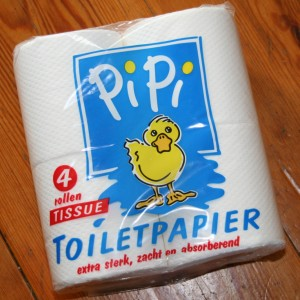

Rien de spécial aujourd'hui, juste allé au [supermarché](/albert-hein-et-compagnie/) pour acheter des choses qui allaient manquer à la maison...

Je suis tombé sur une marque (*pipi*) de **papier toilette** au nom évocateur (pour un français).

{.center}

Je ne sais vraiment pas ce qui est passé dans la tête des gens au moment où ils ont décidé de donner un nom à leur produit. Peut-être que c'est le jaune du canard qui les a inspiré... ou bien la flaque dessinée à ses pieds ?

