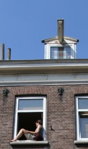

Nous avons déjà vu que les amstelo-damois aimaient prendre le soleil dès qu'il apparaissait. Les moment ensoleillés sont trop rares pour les laisser passer. En voici une nouvelle preuve.

Nous avons vu que les habitants des étages du bas prennent plaisir à occuper les trottoirs quand il fait beau, [pour prendre l'apéro](/revisions-sous-le-soleil) où [pour travailler](/travailler-au-soleil). Ceux qui [disposent de terrasse comme nous](/chambre-avec-vue), ne se gênent pas pour l'utiliser. Pour les autres, si l'on n'aime pas [la foule du Vondelpark](/le-vondelpark), il reste une soluion : **prendre le soleil à la fenêtre**.

{.left}
Bien sûr, on pourrait trouver ça risqué de lire un bouquin à plus de 10m du sol mais quand on veut vraiment prendre le soleil (comme tout Néerlandais qui se respecte) le rebord de la fenêtre est un endroit idéal. Ne croyez pas que je colle ici la photo du seul fou que j'ai croisé de la sorte. Si on déhambule dans les rues de la ville par beau temps, il n'est pas rare de croiser des gens, assis sur le rebord de leur fenêtre. Il y en a moins que sur le trottoir mais croyez-moi, la rareté (toute relative) de cette scène est surtout due à la rareté du soleil...

{.center}