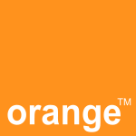

Annoncé via moult publicités en France au printemps dernier, la dilution de la marque Wanadoo [dans Orange](http://super.orange.fr/) a aussi eu lieu dans le pays dont la couleur nationale ressemble à cet opérateur téléphonique.

{.left}Aux Pays-Bas, rien de tout cela n'a eu lieu jusqu'à cet été. Il faut dire que les budgets pub sont moins concéquents. Aux Pays-Bas, Orange est le cinquième opérateur de téléphonie et ne domine pas le marché de la fourniture d'accès internet. Le regroupement des deux marques à malgré tout eu lieu cet été et le site [wanadoo.nl](http://www.wanadoo.nl/) redirige maintenant vers un nouveau site [orange.nl](http://www.orange.nl/) présentant l'ensemble de l'offre sous cette marque. J'y découvre seulement maintenant l'offre câble et téléphonie fixe de Orange. France Télécom annonce aux actionnaires qu'il entend [être leader sur tous les marchés où il est présent](http://www.francetelecom.com/fr/groupe/strategie/). Ce n'est vraiment pas le cas aux Pays-Bas. Ici, Orange est un arrivant récent dans un marché plutôt saturé. Le groupe gagne quelques parts de marché grace à une politique de prix bas ce qui n'est pas [sans affecter les bénéfices](http://www.planet.nl/planet/show/id=118880/contentid=736178/sc=eb2dec). Les Pays-Bas sont [un des pays européen](http://www.francetelecom.com/fr/groupe/strategie/strat/next/international/att00037975/europe.gif) où l'opérateur est déjà installé pour les services de téléphonie mobile$$Aux Pays-Bas Orange à repris les activités de Dutchtone, un consortium créé avec France-Télécom, Deutsche Telekom, ABN AMRO et Rabobank. Les trois derniers acteurs se sont rapidement retirés du consortium, à commencer par Deutsche Telekom qui commercialise aujourd'hui l'offre T-mobile aux Pays-Bas.$$ et les services internet. Il devrait donc profiter de la convergence entre ces technologies pour mettre en place une offre cohérente et attractive qui lui permette d'attirer de nouveaux clients. Ce n'est pas encore gagné.

### Les autres wanadoo

Wanadoo existait aussi en Belgique mais France Telecom s'est retiré de ce marché en 2002 et [a revendu son portefeuille de 85.000 abonnés](http://www.pcinpact.com/actu/news/Wanadoo_Belgique_cede_a_Tiscali.htm) à Tiscali en 2003.

Il n'y a guère qu'en Espagne que la marque [wanadoo](http://www.wanadoo.es) subsiste mais le rachat de l'opérateur mobile [Amena](http://www.amena.com/amena/index.html) par France Telecom cet été laisse présager une convergence des de marques vers celle d'Orange.

### Le cas Belge

L'histoire d'Orange en Belgique est plus passionnant que *[plus belle la vie](http://plus-belle-la-vie.france3.fr/)* tellement il y a de rebondissements. Les relations franco-bataves y sont riches de ''je t'aime, moi non plus''...

# résumé des épisodes précédents
Orange a été créé par Hutchison Whampoa, une société de Hong Kong$$C'est la société de [Li Ka-shin](http://www.forbes.com/lists/2006/10/SO0W.html), l'homme le plus riche d'Asie...$$ qui se lance sur le marché anglais en 1994. jusqu'en 1998, l'opérateur se développe aux Royaume Unis et ailleurs dans le monde grâce à de noumbreux accords. En Belgique, la marque Orange est lancée grâce à une joint venture crée à 50/50 avec le Néerlandais KPN. C'est en 1999 et quelques mois après, France Télécom s'implante en Belgique en rachetant plus de 50% de l'opérateur Mobistar. Pour l'accès Internet, c'est en 1998 que France Telecom s'était implanté en Belgique, par le rachant de Euronet internet qui est devenu en 1999 wanadoo Belgique.

# Grand chambardement chez Orange.
Fin 1999 la bulle internet n'en finie pas de gonfler, les opérateurs telecom rachètent tout ce qui se vend à des prix exhorbitants. Manesmann AG rachète Orange qui se fait bouffer à son tour par Vodafone. Le problème est que le regroupement de Orange et Vodafone met la nouvelle entitée en situation de quasi monopole dans plusieurs endroits de la planète. La Commission Européenne conditionne le rachat de Manesmann à la revente de Orange. KPN est sur les rangs mais c'est finalement France Telecom qui s'offre l'opérateur orange pour presque 40 milliards d'euros. 

# Ménage en Belgique
France Telecom regroupe toutes ses activités en Belgique mais ne peut pas garder deux opérateurs (Orange à 50% avec KPN et Mobistar à plus de 50%) Il décide de conserver le leader Mobistar et de céder ses parts à KPN. Un accord autorise cependant KPN à continuer à utiliser la marque Orange jusqu'en 2002 après quoi le réseau est renomé BASE. Il n'y aura pas de mariage franco-batave en Belgique.

# Les lendemains qui déchantent
La bulle internet éclate et les opérateurs doivent maintenant payer toutes ces opérations chèrement négociées. KPN et France Télécom ont des problèmes de trésorerie et doivent se séparer de certaines filiales. Les deux sociétés conservent leurs filiales belges de téléphonie mobile mais en 2003, France Telecom se sépare de sa filiale wanadoo belge.

# Rebondissements
En 2004, alors que Mobistar ne s'appelle toujours pas Orange, KPN mobile envisage de se regrouper avec l'anglais O2. Les groupes sont assez complémentaires mais ils ont chacun un réseau en Allemagne... KPN se proposait alors de racheter O2 mais l'offre fut déclinée. Le nom de Orange fut alors évoqué pour racheter KPN mobile. Problème : Orange se retrouverait alors avec deux réseau en Belgique... Finalement c'est Telefónica qui a racheté O2 en 2005.

# À suivre
[Mobistar ne s'appelle toujours pas Orange](http://www.astel.be/Mobistar-se-prepare-a-devenir-Orange_1325) mais le changement de nom est envisagé depuis deux ans... Le problème en Belgique c'est que Orange a déjà existé avant et qu'à l'époque, c'était un autre réseau.

### Voir aussi [France Telecom vends Orange Nederland à Deutsche Telekom](/les-petites-courses-de-l-ete) (septembre 2007)