Samedi dernier, Michiel nous a invité à faire de la voile (Zeilen) en Frise ([une province](/etape-en-pays-bas) au nord). [Notre petit groupe](http://alix.guillard.fr/phototeque/view_photo.php?set_albumName=zeil-friesland&id=P5img_6918_Sloten) est donc parti avec lui et nous avons passé une agréable journée ensoleillée sur l'eau. Voici quelques photos pour  vous montrer comment c'était bien. Merci Michiel pour cette journée.

[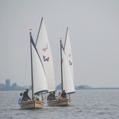|http://www.flickr.com/photos/13274211@N00/249737140/] Deux de nos bateaux (je suis dans le 3e)

[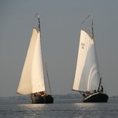|http://www.flickr.com/photos/13274211@N00/249734175/] Deux autres bateaux plus grands

[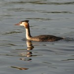|http://alix.guillard.fr/phototeque/view_photo.php?set_albumName=zeil-friesland&id=P5img_6792] Un canard huppé

[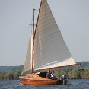|http://www.flickr.com/photos/13274211@N00/249737148/] Un genre de sabot à voile

[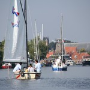|http://alix.guillard.fr/phototeque/view_photo.php?set_albumName=zeil-friesland&id=P5img_6794] Pour manger on est allé à Sloten ...

[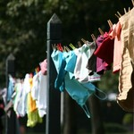|http://www.flickr.com/photos/13274211@N00/249734178/] ... charmant village de frise ...

[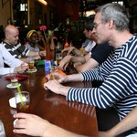|http://alix.guillard.fr/phototeque/view_photo.php?set_albumName=zeil-friesland&id=P5img_6809] ... où l'apéro vaut le coup ...

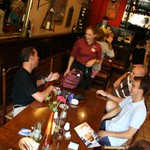 ... et les serveuses sont sympa.

[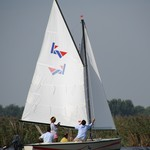|http://alix.guillard.fr/phototeque/view_photo.php?set_albumName=zeil-friesland&id=P5img_6832] Nous sommes repartis

[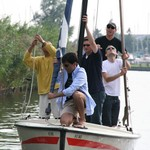|http://alix.guillard.fr/phototeque/view_photo.php?set_albumName=zeil-friesland&id=P5img_6830] Il a fallut enlever le mat

Il faut démonter le mat avant d'arriver au niveau du pont sur le canal. Sinon, on ne peut pas passer sans casser le bateau. Il y a aussi possibilité de demander à faire lever le pont. Un écriteau annonce que toute ouverture de pont coûte 2 euros. Le *garde-pont* collecte les péages avec [un sabot](http://alix.guillard.fr/phototeque/view_photo.php?set_albumName=zeil-friesland&id=P5img_6896) accroché au bout d'une canne à pêche. Comme il y avait des Néerlandais avec nous, nous avons préféré retirer le mat.

[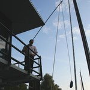|http://alix.guillard.fr/phototeque/view_photo.php?set_albumName=zeil-friesland&id=P5img_6895] Sinon il faut payer

[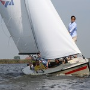|http://alix.guillard.fr/phototeque/view_photo.php?set_albumName=zeil-friesland&id=P5img_6773] On a fait la course

[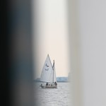|http://www.flickr.com/photos/13274211@N00/249737143/] Les autres sont partis loin

[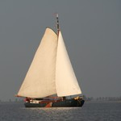|http://www.flickr.com/photos/13274211@N00/249734188/] Encore un gros voilier

[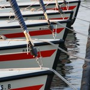|http://www.flickr.com/photos/13274211@N00/249734184/] Retour au parking à bateaux