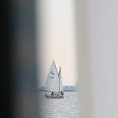

Samedi dernier, Michiel nous a invité à faire de la voile (Zeilen) en Frise ([une province](/etape-en-pays-bas) au nord). [Notre petit groupe](http://alix.guillard.fr/phototeque/view_photo.php?set_albumName=zeil-friesland&id=P5img_6918_Sloten) est donc parti avec lui et nous avons passé une agréable journée ensoleillée sur l'eau. Voici quelques photos pour  vous montrer comment c'était bien. Merci Michiel pour cette journée.

Deux de nos bateaux (je suis dans le 3e)

Deux autres bateaux plus grands

Un canard huppé

Un genre de sabot à voile

Pour manger on est allé à Sloten ...

](http://www.flickr.com/photos/13274211@N00/249734178/)
 ... charmant village de frise ...

 ... où l'apéro vaut le coup ...

 ... et les serveuses sont sympa.

Nous sommes repartis

Il a fallut enlever le mat  
  
Il faut démonter le mat avant d'arriver au niveau du pont sur le canal. Sinon, on ne peut pas passer sans casser le bateau. Il y a aussi possibilité de demander à faire lever le pont. Un écriteau annonce que toute ouverture de pont coûte 2 euros. Le *garde-pont* collecte les péages avec [un sabot](http://alix.guillard.fr/phototeque/view_photo.php?set_albumName=zeil-friesland&id=P5img_6896) accroché au bout d'une canne à pêche. Comme il y avait des Néerlandais avec nous, nous avons préféré retirer le mat.

Sinon il faut payer

On a fait la course

 
Les autres sont partis loin

 
Encore un gros voilier

Retour au parking à bateaux
