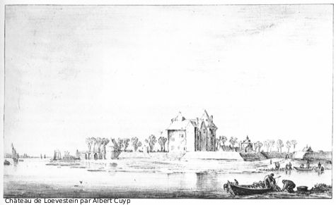

Je vous ai déjà présenté [le marché](/albert-cuyp-le-marche) qui porte le nom de cette rue mais pas le peintre qui a donné son nom à la rue.

'*Aelbert Jacobsz Cuyp*' (1620-1691) est donc un peintre paysagiste hollandais du 17e siècle, cette époque où les plus grands peintres étaient hollandais. Je ne suis pas très fan de toute cette vieille peinture mais elle est inévitable dans ce pays, surtout quand on va au marché... Pour en découvrir plus, je peux vous inviter à vous pencher sur la notice de ce peintre [sur le site du Rijksmuseum](http://www.rijksmuseum.nl/aria/aria_artists/00018472?lang=nl&context_space=&context_id=).

Albert Cuyp aurait tout appris de Jacob Gerritsz mais il se serait démarqué ensuite en peignant des paysages à l'apparence plus exotique qu'on disait d'inspiration italienne. En fait, il n'est jamais allé en Italie (Il était trop confortablement installé dans son appartement bourgeois de Dordrecht). Ce peintre est surtout connu pour son traitement de la lumière. Ses tableaux représentent souvent des scènes éclairées par la lumière rasante du soleil couchant ou levant, révèlant souvent des détails inatendus dans le paysage.

{.center}

Vous pouvez admirer quelques ?uvres qu'on lui a attribué [sur le site de exit to art](http://www.exittoart.nl/framesetmain.htm?http://www.exittoart.nl/gallery1.htm?http://www.exittoart.nl/cuyp/schilderijindex.htm).
