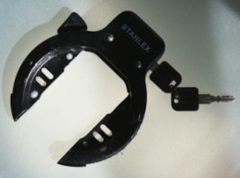
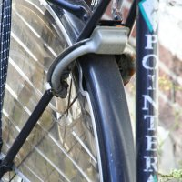

{.center}

Depuis que j'ai [mon B'twin](/un-b-twin-a-amsterdam) à Amsterdam, j'utilise moins de [strippenkaart](/la-strippenkaart) et plus le vélo pour mes déplacements. Comme tout le monde, j'ai peur qu'on me vole mon vélo et je lui mets plusieurs antivols. L'un de ces antivols est typiquement Néerlandais et est plutôt pratique.

{.left}Ce cadenas se fixe sur le cadre à l'arrière du vélo, juste au dessus de la roue. Un loquet permet de le fermer et de bloquer ainsi la roue arrière. L'ouverture est très simple, grâce à un ressort, un simple quart-de-tour de clef permet au cadenas de s'ouvrir rapidement. Le *clac!* sonore qui se produit alors prévient les voisins que vous prenez votre vélo et tout le monde est très content. Ces cadenas équipent souvent les vélos hollandais ([les vrais](/plein-de-velos)) de série mais il est aussi possible d'en ajouter sur un vélo qui n'en a pas.

Il se fixe aisément sur tous les vélos hollandais puisque tous leurs cadres possèdent des ergots avec pas de vis permettant de fixer solidement ce cadenas au vélo (Voir [les caractéristiques des vélos hollandais](/plein-de-velos-hollandais)). Bien sûr, les vélos *made in France* comme mon B'twin et la *bicyclette hollandaise* de Sophie n'en ont pas. J'ai donc du utiliser quelques uns de mes talents de bricoleur y attacher ce cadenas hollandais avec du fil de fer.

Un autre avantage de ce cadenas est l'obligation, sur la plupart des modèles, de laisser la clef dessus quand le cadenas est ouvert. Il est plus difficile de laisser son vélo non attaché quand on le gare puisqu'il faut le fermer en reprenant ses clés. Bien vu.

<!-- HTML -->

<a href="/plein-de-velos-hollandais" title="tout savoir sur la bicyclette aux Pays-Bas">
<!-- / HTML -->
**Plein de vélos hollandais**  
{.center}  
1) Les avantages  
<!-- HTML -->
</a>

<!-- / HTML -->

<!-- HTML -->

<a href="/plein-de-velos" title="tout savoir sur la bicyclette aux Pays-Bas">
<!-- / HTML -->
**Plein de vélos hollandais**  
{.center}  
2) Les styles
<!-- HTML -->
</a>

<!-- / HTML -->

<!-- HTML -->

<a href="/plein-de-velos-hollandais-3" title="tout savoir sur la bicyclette aux Pays-Bas">
<!-- / HTML -->
**Plein de vélos hollandais**  
{.center}  
3) Les marques
<!-- HTML -->
</a>

<!-- / HTML -->

<!-- HTML -->

<a href="/plein-de-velos-pas-hollandais-4" title="tout savoir sur la bicyclette aux Pays-Bas">
<!-- / HTML -->
**Plein de vélos hollandais**  
{.center}  
4) Les marques étrangères
<!-- HTML -->
</a>

<!-- / HTML -->

<!-- HTML -->

<a href="/une-heure-sans-velo" title="tout savoir sur la bicyclette aux Pays-Bas">
<!-- / HTML -->
**Plein de vélos hollandais**  
{.center}  
5) Parking à vélos
<!-- HTML -->
</a>

<!-- / HTML -->

<!-- HTML -->

<a href="/les-velos-de-location" title="tout savoir sur la bicyclette aux Pays-Bas">
<!-- / HTML -->
**Plein de vélos hollandais**  
{.center}  
6) Vélos de location
<!-- HTML -->
</a>

<!-- / HTML -->

<!-- HTML -->

<!-- / HTML -->
---
<!-- notes:
http://www.canalblog.com/cf/fe/tb/?bid=68621&pid=1560269 PING
--->
