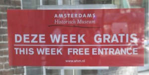
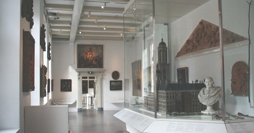

Le musée historique d'Amsterdam propose une semaine gratuite pour son aniversaire. Allez-y ça vaut le coût

{.center}

[Cette page](http://www.ahm.nl/nieuws_artikel.php?id=112) de leur site annonce : *Inmiddels traditioneel, de gratis week in het AHM in het najaar. We vieren onze verjaardag en die van de stad Amsterdam met een week gratis toegang. Dit jaar is dat van 2 tot en met 8 oktober.*

*Inmiddels traditioneel, de gratis week in het AHM in het najaar. We vieren onze verjaardag en die van de stad Amsterdam met een week gratis toegang. Dit jaar is dat van 2 tot en met 8 oktober. Elke dag om 14.00 uur kunt u vanaf de kassa, onder leiding van onze gidsen mee op ontdekkingstocht door de geschiedenis van Amsterdam.*

{.center}

Je pense que c'est assez clair pour vous inciter à y aller. 

Sinon, je peux aussi vous dire qu'on y trouve tout ce qui faisait la vie des Amstelodamois depuis le moyen-âge jusqu'à aujourd'hui. J'y ai même vu un film expliquant comment les travaux de [la Noord/Zuidlijn](/la-ligne-du-nord-au-sud) étaient combinés avec des fouilles archéologiques. Mais on peut aussi voir comment on vivait à l'age d'or des Provinces-Unies, comment on vivait moins bien sous la domination française alors que le roi s'était enfin installé à Amsterdam. On peut aussi voir des photos et tracts des manifestations provo des années 60 ou une carte de l’expansion des coffeeshops depuis ces mêmes années 60.

La superproduction préférée de ce musée est justement la *Groeikaart* (Carte de l'expansion) que l'on peut retrouver en flash sur leur site (enfin à l'époque ou le flash était encore à la mode). On retrouve des épisodes de cette carte sur petit écran dans quelques salles du musée pour introduire les moment phares de l'histoire de la ville.
