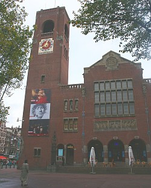
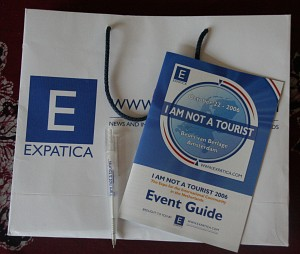

Après [Linux-World](/linux-world-utrecht), voici un salon d'un tout autre genre dont le nom reprend le cri du cœur de la majorité des visiteurs. Je suis dans un pays étranger, j'essaye de comprendre la langue et les coutumes mais [je ne suis pas un touriste](http://www.expatica.com/notatourist/)!

{.right}
## Un lieu unique

Le salon avait lieu dans le hall de *Beurs van Berlage*. Cette grande construction en brique est l'?uvre de Berlage, un architecte Néerlandais du début du XXe siècle. J'espère avoir le temps un jour de vous parler de lui sur ce blog. Ce hall d'exposition est situé sur Damrak, l'axe qui relie la gare centrale à la place du Dam. C'est sans nul doute la rue la plus fréquentée par les touristes à Amsterdam. Organiser un salon *I am not a tourist* à cet endroit tient de la boutade. [Expartica](http://www.expatica.com), a aussi organisé un salon similaire à Paris, [Welcome to France](http://www.expatica.com/welcometofrance/) a eu lieu au Carrousel du Louvre.

## Un lieu anglophone

Je pense que c'est pareil dans beaucoup de pays. La langue véhiculaire des expatriés du monde est l'anglais. C'était aussi la langue du salon. Les stands Néerlandais (avocats, dentistes, banque, agents immobilier...) alignaient leurs offres dans la langue de Phil Collins. Les activités sur scène étaient en anglais et chez les agences de recrutement internationales, je n'ai rencontré que des britanniques. Les partenaires média étaient tous des journaux de langue anglaise. Dans cet environnement 100% anglophone, les seules *non-profit organizations* présentes étaient issues du monde anglo-saxon (Irish club, Ambassade du Canada, American Business Club, New Zealand Expat Association...) Aucune présence francophone, hispanophone ou lusophone. Pourtant, Des organisations existent et les expats parlant espagnol portugais ou français circulaient dans les allées du salon, parlant anglais comme tout le monde...

## Un lieu de sortie dominicale
{.left} Ce salon a eu lieu dimanche dernier. La visite du salon pourrait presque être une sortie du dimanche avec des dégustations de vin ou un spectacle d'improvisation théâtrale au programme. La plupart des stands *non-profit* pouvait aussi vous aider à préparer une sortie pour un autre dimanche. Il y avait là un musée de sacs à main et des associations regroupant des expatriés de même origines et organisant des soirées et sorties. Même la *Communications Christ Church* avait quelque chose à proposer le dimanche.

## Un lieu à services

Le reste des stands offraient des services plus quotidien à destination des expatriés. J'ai déjà parlé de services de banque, d'assurance et de santé. Les Écoles internationales étaient là aussi. Les conseillers immobiliers, financiers, ou juridiques offraient plein de petits gâteaux pour attirer le chaland. J'ai bien sûr été intéressé par les agences de recrutement qui vont bientôt recevoir mon CV. Les écoles de langue, on verra plus tard.
