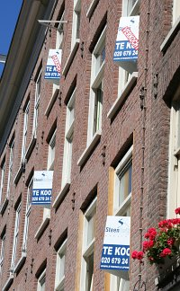
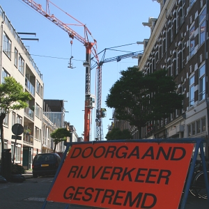

... et toujours.

[{.left}](http://www.flickr.com/photos/13274211@N00/408905545/) Quand j'ai cherché l'[appart dans lequel nous vivons](/demenagement-en-photos), je me suis bien rendu compte que le marché était aussi excité qu'[à Paris](https://alix.guillard.fr/67m/post/bon-pour-une-devaluation-de-votre-bien.html). Quand on tient un appart, il faut faire une offre tout de suite. C'est aussi valable pour l'achat. Le quartier dans lequel nous avons attérit (*de Pijp*) est encore plus recherché. Son [coté cosmopolite](http://laurentchambon.blogspot.com/2006/10/la-diversit-amstellodamoise-la-loupe.html) et son histoire populaire est très excitante pour les bobos qui sont les gens qui achètent le plus d'appart en ce moment. Le résultat est là : le quartier est pris d'assault par les prommoteurs immobiliers. Il y a beaucoup de réabilitation de bâtiments ou de construction neuves tout autour. Les deux photos de ce billet ont été prise le même jour dans la même rue : Un immeuble fraichement réaménagé avec déjà deux apparts vendus (*verkocht*) sur quatre en vente (*te koop*). 

Un peu plus loin la rue est barrée pour cause de travaux. Ce ne sont pas des travaux de voirie, comme les terrains sont petits, les matériaux sont montées à l'aide de grues implantées sur la chaussée. Ici, il y a deux chantiers en face l'un de l'autre et deux grues, une pour chacun des chantiers. Le technicien remarquera que les grues n'ont pas de contre-flèche. La rue est étroite et il n'est pas permis de survoler les autres habitations avec une flêche de grue. Les contrepoids sont donc au pied de la grue, retenus par des câbles.

{.center}

Ces photos sont dans mon album depuis un moment et je ne vous les ai pas encore montrées. Mais hier, un [article de Laurent chambon sur l'immobilier à Pijp](http://laurentchambon.blogspot.com/2006/10/ballade-australovicienne-2.html) complète très bien ce que je voulais écrire et que je vous ai fait lire aujourd'hui.

* [Voir la photo en plus grand](http://www.flickr.com/photos/13274211@N00/408905545/)
* et aussi [les travaux dans ma rue](/des-travaux-dans-ma-rue)
* et enfin, le point un an apres, des [nouvelles de l'immobilier](/des-nouvelles-de-l-immobilier)
