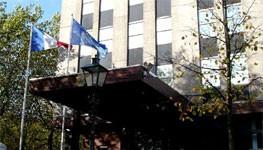

Je lis déjà la presse néerlandaise. Je suis au courant de tous les potins politiques, culturels, des analyses sociales et économiques. Quand un journal décide d'aborder un sujet en rapport avec la France, je suis aussi tenu informé. Pourtant, je ne comprends toujours pas le néerlandais et j'ai toujours du mal à lire certains panneaux dans le rue. En fait j'ai un truc.

{.left}
L'[Ambassade de France à La Haye](http://www.ambafrance-nl.org/france_paysbas/spip.php?rubrique62) dispose d'un site web bilingue pour faire la promotion de la France auprès des néerlandais et informer les français sur les relations franco-bataves. La rubrique que je visite régulièrement est la [Revue de presse néerlandaise](http://www.ambafrance-nl.org/france_paysbas/spip.php?rubrique539) en français. Tous les jours le service de presse de l'Ambassadeur épluche la presse quotidienne et les grands magazines du pays. Les sujets sont triés traduits et remis en forme avec un véritable travail éditorial. c'est un service de nouvelles quotidien dont on peut difficilement se passer quand on ne parle pas la langue.

Je regrette qu'il n'y ait pas de flux RSS disponible pour ces nouvelles mais il est quand même possible de s'[abonner à un service](http://www.ambafrance-nl.org/france_paysbas/spip.php?article9717) qui envoie un résumé de cette revue de presse tous les jours par mail. L'ambassade de France aux Pays-Bas publie d'autres bulletins mais cette revue de presse est, à mon goût, la plus intéressante.

Lire aussi:

* [Renouvellement diplomatique](/renouvellement-diplomatique)
* [La nouvelle ambassade de France](/Une-nouvelle-Ambassade-de-France)
* [Un ambassadeur qui tombe à pic](/Un-ambassadeur-qui-tombe-a-point-nomme)