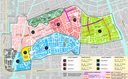
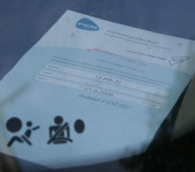
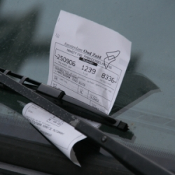

J'ai parlé des déboires que les visiteurs affrontaient en voulant [se garer à Amsterdam en voiture](/a-amsterdam-se-garer-coute-cher), mais il en es de même pour les habitant. Il faut de la patience et de la percévérence pour obtenir une autorisation de parking pour résident. Dans le centre **la liste d'attente est de sept ans**, dans le Pijp où nous habitons, elle est de six mois.

La gestion du stationnement en ville est déléguée à des sociétés spécialisées qui sont je pense privées. Pour le centre c'est [Stadstoezicht](http://www.stadstoezicht.amsterdam.nl/live/). Dans mon quartier, à la municipalité libérale, c'est la société privée [PCH Parkeerservices](http://www.parkereninoudzuid.nl). Ils gèrent les parcmètres et aussi les demandes de stationnement résidentiel. 

<!-- HTML -->

<!-- / HTML -->
**AJOUT** : L'information ci dessus n'est plus à jour, la mairie gère maintenant directement le stationnement de courte durée et résidentiel dans toute la ville d'Amsterdam.
<!-- HTML -->

<!-- / HTML -->

Le plus surprenant pour le parisien fraichement arrivé ce sont les fonctions de police qu'on a délégué à ces entreprises. Ce sont elles qui verbalisent que ce soit pour non paiement du parking ou mauvais stationnement. Ce sont aussi ces entreprises qui ont la charge de poser les sabots et enlever les véhicules qui restent trop longtemps en place.

### Demande de stationnement résidentiel

Le bureau du PCH Parkeerservices est situé à coté des services municipaux. Lorsque je me suis déplacé à cette annexe de la mairie de Amsterdam Oud Zuid pour demander des renseignement sur le stationnement résidentiel, je n'ai eu que 10 mètres à faire pour trouver des réponses à mes questions. Les fonctionnaires, pardon, les employés de PCH Parkeerservices, sont très accueillants et m'ont donné tous les renseignements pour que je puisse constituer mon dossier.

### Constituer sa demande

Biensûr, comme toute démarche administrative, il y a des rebondissements, surtout pour les étrangers (qui ne comprennent vraiment rien). J'ai du revenir présenter mon dossier trois fois pour qu'il soit effectivement reçu. Comme je savais déjà que la liste d'attente était de 6 mois à un an, j'enrageais à chaque délai supplémentaire. Pour résumer, il faut apporter les papiers de la voiture et le certificat de circulation, une preuve de résidence qui peut être un contrat de bail. Un formulaire de demande rempli et signé ainsi que :

* **pour les étrangers :** des papiers d’identité faisant mention d'un [enregistrement en mairie](/mes-premiers-pas-comme-immigre)
* **pour les voitures de société :** Une lettre de l'entreprise indiquant qui est le conducteur habituel du véhicule
* **pour les personnes ne venant pas déposer eux même leur demande :** le formulaire spécial donnant procuration à une personne, elle aussi enregistrée en mairie

Normalement quand on s’enregistre en mairie, il faut aussi s’enregistrer à l'IND (le ministère de l'intégration) mais jugeant que cette démarche n'était pas très *européenne*, j'ai évité de le faire.

### Attendre et marcher
<!-- HTML -->

<!-- / HTML -->
[{.left}](/files/data/OZUID-plattegrond-vergunningen.pdf)
<!-- HTML -->
<a href="/files/data/OZUID-plattegrond-vergunningen.pdf">Carte des zones de Parking Oud Zuid</a> (PDF)

<!-- / HTML -->

La demande a enfin été déposée au mois de juin et l'employé annonce à ce moment là que la liste d'attente, pour la zone de résidence est longue. Il y a néanmoins possibilité de se garer dès maintenant à perpète dans une autre zone. Une sorte de stationnement résidentiel où la distance minimum entre la voiture et la maison est de 20 minutes à pied et 10 minutes en vélo. Pour comprendre mieux, nous habitons en zone 2 (vert) et l'autorisation nous a été délivré en zone 3 (bleue) sur la carte ci-contre. Biensûr le droit de stationnement résidentiel est payant et la facture est trimestrielle. Fin août, une facture nous est envoyée nous proposant de renouveler ce stationnement *résidentiel mais loin*. Impossible de savoir si notre demande sera reçue bientôt ou pas. On paye encore...

### Fêter la victoire
Jeudi dernier, une lettre de PCH Parkermachin nous annonce qu'on a enfin obtenu le droit de stationner dans la zone demandée et que nous avons la possibilité de refuser. Je suis aller leur dire le lendemain que je ne refuserais pas. L'autorisation m'a été remise sur le champ et nous avons fêté notre premier week-end avec la voiture légalement à proximité de la maison.

### Le fonctionnement
Une fois que la société nous assure que nous pouvons nous garer dans la zone demandée ([voir carte](/public/files/OZUID-plattegrond-vergunningen.pdf) (PDF)). Notre immatriculation se retrouve dans leur grand ordinateur. Il n'y a pas de vignette ni de papillon à afficher sur le pare-brise. Les agents verbalisateurs qui circulent dans la ville entrent le numéro de toutes les voitures qu'ils croisent dans un terminal et si le numéro n'est pas dans le grand ordinateur, crack# PV! Une preuve de l'enregistrement dans le grand ordinateur nous est quand même remise et il est conseillé de poser cette feuille visiblement dans la voiture durant la première semaine en cas de délai dans l’enregistrement de l'autorisation.

<!-- HTML -->

<!-- / HTML -->
 
<!-- HTML -->
Une belle illustration de ce que je viens d'écrire : Si tu n'as pas la feuille de gauche, on te pose le ticket de droite.

<!-- / HTML -->
---