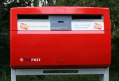
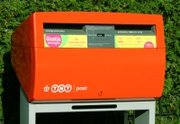
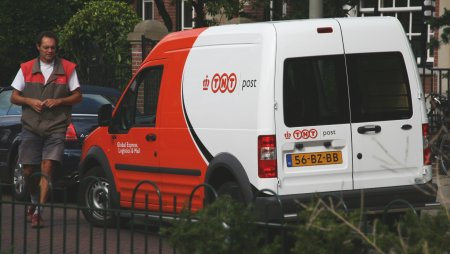

C'est peut-être un hasard mais **les services postaux des Pays-Bas** sont de plus en plus oranges... Explications :

Quand je vous ai parlé du [prix des timbres](/les-tarifs-postaux), je vous ai dit que la société qui s'occupait du courrier postal aux Pays-Bas s'appellait **TPG Post**. Ce n'est plus le cas. Aujourd'hui, la poste des Pays-Bas s'appelle officiellement **TNT Post**. Le rouge qui dominait jusqu'à présent sur les camions postaux et les boîtes-aux-lettres publiques est ammené à devenir de plus en plus orange, aux couleurs et au nom de la holding mère : __[TNT N.V.](http://fr.wikipedia.org/wiki/TNT_NV)**. Cette société n'est pas inconnue, elle est déjà un acteur mondial dans le domaine du transport express et des messageries. C'est par exemple un sous traitant de **La Poste** en France pour l'acheminement des colis.

### La privatisation des PTT
{.left}
Aux Pays-Bas comme en France, les Postes, Télégraphes et Téléphones était un service public qu'on appellait **PTT**. Dans les années 80, une directive européenne impose aux services des postes et télécommunication de chaque état de ne plus recevoir d'aides des états afin de ne pas fausser la concurence lorsque ces derniers exportent leurs services. En France, les administrations **PTT Télécomunications** et **PTT Poste** sont séparées en 1988. **France-Telecom** devient une S.A. en 1996 et sa privatisation a lieu en deux étapes entre 1997 et 1998. **La Poste** est transformé en établissement public en 1991 et a gardé cette forme depuis[^1]. 

Les Néerlandais ont été plus rapides pour tout cela. L'administration des PTT est privatisée en 1989[^2] et devient **Koninklijk PTT Nederland**. Deux entitées sont crées (**PTT telecom** et **PTT post**). Les deux entités sont distinctement séparées en 1998, avec d'un coté **Koninklijk KPN Telecom**[^3] et de l'autre **PTT Post** qui est devenu **TPG Post** en 2002.

### Le boum de la TNT[^4]
{.left}
À l'origine, TNT voulait dire **Thomas Nationwide Transport__, C'était une société de messageries et de transports australienne. Cette société s'est beaucoup développée depuis 1946 au point d'interesser un groupe de postes européennes et canadiennes qui la rachète en 1992. Quatre ans plus tard, TNT intègre KPN suite à une OPA amicale. Dès lors, tout le travail a été de détacher cette structure de KPN et d'y intégrer les activités de la PTT Post. C'est maintenant chose faite et la poste Néerlandaise peut donc changer de nom[^5].

### Une nouvelle ligne orange
Avant l'annonce officielle, il n'était pas rare de voir des camions oranges TNT Post dans les rues ainsi que quelques boîtes-aux-lettres changées à l'avance. L'annonce du changement a maintenant été faite officiellement par un courrier personnel à tous les clients (toute personne disposant d'une adresse postale). Le courrier est daté du [16 octobre](http://www.tntpost.nl/overtntpost/nieuwspers/persberichten/2006/10/naamswijziging.aspx) et indique : *TPG Post heet vanaf vandaag TNT Post*.

{.center}

----

[{.center}](http://nl.wikipedia.org/wiki/PTT_%28Nederland%29)
---
[^1]: La séparation des services financiers et des services postaux en 2006 présagent une privatisation prochaine
[^2]: [La Postbank](/postbank-amsterdam) avait été privatisée en 1986, elle fait partie du groupe ING depuis 1991.
[^3]: Le [Koninklijk](/koninklijk-le-predicat-royal) a été ajouté à KPN, une abréviation qui le reprend déjà. C'est un peu ridicule mais c'est comme ça
[^4]: Avec un titre pareil je vais avoir plein de gens qui vont visiter mon site pensant avoir les programmes de France 4...
[^5]: L'histoire de la compagnie est disponible sur [le site officiel de TNT](http://group.tnt.com/aboutus/frequentlyaskedquestions/index.asp)