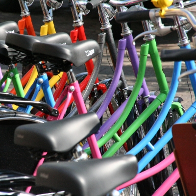

Le **vélo hollandais**, vous le connaissez, on en vend dans les catalogues [Camif](http://www.camif.fr/wwwSurf/pages/multimedia/liste.asp?CODE_RAYON=123&CODE_UNIVERS=2) et chez [Decathlon](http://www.decathlon.fr/FR/Product_arborescence/cycle-and-rolle/bikes/index.html). Il y a écrit vélo hollandais dessus et il est noir avec un panier pourri accroché sur le devant. Ça fait plus chic de dire vélo hollandais que de dire vélo de ville alors tout le monde dit vélo hollandais....

Pendant ce temps, aux Pays-Bas, les vrai vélos hollandais sont fabriqués aux Pays-Bas, avec des cadres solides, des guidons cintrés pour une conduite confortable et des rétropédalages pour freiner sans les mains, des fixations spéciales pour [cadenas](/cadenas-special-velo) et des couleurs pour tous les goûts. Voici quelques modèles exposés au soleil de cet été devant un magasin de vélos ... hollandais.

[{.center}](https://www.flickr.com/photos/13274211@N00/271214885/)

Et aussi:

<!-- HTML -->

<a href="/plein-de-velos-hollandais" title="tout savoir sur la bicyclette aux Pays-Bas">
<!-- / HTML -->
**Plein de vélos hollandais**  
{.center}  
1) Les avantages  
<!-- HTML -->
</a>

<!-- / HTML -->

<!-- HTML -->

<a href="/plein-de-velos" title="tout savoir sur la bicyclette aux Pays-Bas">
<!-- / HTML -->
**Plein de vélos hollandais**  
{.center}  
2) Les styles
<!-- HTML -->
</a>

<!-- / HTML -->

<!-- HTML -->

<a href="/plein-de-velos-hollandais-3" title="tout savoir sur la bicyclette aux Pays-Bas">
<!-- / HTML -->
**Plein de vélos hollandais**  
{.center}  
3) Les marques
<!-- HTML -->
</a>

<!-- / HTML -->

<!-- HTML -->

<a href="/plein-de-velos-pas-hollandais-4" title="tout savoir sur la bicyclette aux Pays-Bas">
<!-- / HTML -->
**Plein de vélos hollandais**  
{.center}  
4) Les marques étrangères
<!-- HTML -->
</a>

<!-- / HTML -->

<!-- HTML -->

<a href="/une-heure-sans-velo" title="tout savoir sur la bicyclette aux Pays-Bas">
<!-- / HTML -->
**Plein de vélos hollandais**  
{.center}  
5) Parking à vélos
<!-- HTML -->
</a>

<!-- / HTML -->

<!-- HTML -->

<a href="/les-velos-de-location" title="tout savoir sur la bicyclette aux Pays-Bas">
<!-- / HTML -->
**Plein de vélos hollandais**  
{.center}  
6) Vélos de location
<!-- HTML -->
</a>

<!-- / HTML -->

<!-- HTML -->

<!-- / HTML -->
---