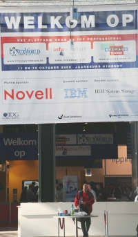

{.left}
La semaine dernière, je suis allé à Utrecht. J'ai pris le train pour me rendre à un salon qui aurait pu m'interesser : [Linux World 2006](http://www.linux-world.nl/sites/www_linux-world_nl/nl/index.asp). Le salon n'était pas trop à la hauteur de mes attentes mais comme ça m'a permis de faire du tourisme, je vais vous en parler un peu. Linux World se tenait dans un hall d'exposition en compagnie de deux autres salons informatique : **infosecurity.nl** et **storage expo**. Linux World était le plus petit salon. Je n'ai pas vu grand chose des conférences puisque je n'étais pas là pendant celles en anglais mais les thèmes n'étaient pas très sexy à mon goût. Pour le reste du salon, il n'y avait pas beaucoup d'exposants. Un gros stand vert Novell-suse faisait face à un gros stand rouge Red-hat venu de Belgique. Un coin des associations, géré par l'[Internet Society Nederland](http://www.isoc.nl) regroupait quelques assos nationnales dont les membres avait déserté le salon pour aller aux conférences ou ailleurs. Un carré de 70 m² avec personne dessus et quelques tracts qui trainent.

On est loin de ce que peut offrir le salon analogue à Paris. [Solutions Linux Paris](http://www.solutionslinux.fr), c'est quand même autre chose. Un salon unique, plus d'exposants, plus d'[associations](http://www.assoces-libres.org/) avec [des stands toujours disponibles](http://www.assoces-libres.org/article.php3?id_article=107)... et aussi plus de visiteurs. Le premier jour les organisateurs de Linux World étaient fiers de m'annoncer par SMS, 600 visiteurs. Linux n'est vraiment pas une mode ici...

Le salon Linux World avait lieu à la **Jaarbeurs**, le Hall d'exposition de la ville (qui a obtenu le [koningklijk](/koninklijk-le-predicat-royal)), juste à coté de la **gare Utrecht CS**. Il hébergeait aussi une sorte de salon de l'Étudiant qui devait être 5 fois plus grand et plus fréquenté que les salons informatiques sus-cités. J'aurais dût être étudiant.

{.center}

## Et aussi
[Mozilla aux Pays-Bas](/mozilla-aux-pays-bas)  
[Amsterdam adopte le libre](/amsterdam-adopte-le-libre)  
[Notre Microsoft ne marche plus](/microsoft-ne-marche-plus)  
