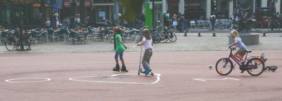

Marie Heineken est le nom donné à une place tout près de chez moi. C'est une place parfaitement ronde avec des bâtiments modernes autour et un des rare immeubles de plus de 4 étages du quartier. Elle est juste derrière le bâtiment des brasseries Heineken et le musée *[Heineken Experience](http://www.heinekenexperience.com/index.jsp)*. Je pense donc que le nom de la place n'est pas anodin.

Comme je passe souvent sur cette place, je vous en parlerais surement encore. Ce qui a attiré mon appareil photo cette fois ci c'est la grande peinture de sol qui est au milieu de la place depuis le mois d'août. O.M. avec un Cœur au milieu...

{.center}

En bon français, je me suis dit que cela voulait dire « **Olympique de Marseille** ». Un touriste un peu fan serait venu cet été après [la coupe du monde](/on-est-en-finale) et n'aurait pas osé écrire le nom de l'équipe nationale. Alors, en prévision d'un match de la coupe des clubs champions contre l'[Ajax](http://www.ajax.nl/web/show), il a tracé en gros les lettres OM au millieu de la place.

Il faudra que je montre tout ça à **Olivier et Martina**...
---