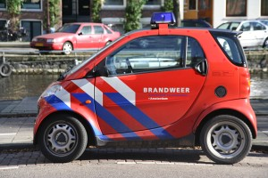

Ce matin, j'ai appris un nouveau mot : ***brand*** ça veut dire **incendie**.

Je ne sais pas pourquoi mais ce matin, aux informations, il n'était question que d'incendies. Je ne sais vraiment pas qui a mit le feu aux poudres mais ça brûlait de toutes parts.

## Feux de forêts en Californie
Un court passage montrait des hélicoptères lachant de l'eau au dessus des montagnes californiennes. Un feu de forêt y sévit actuelement et plusieurs centaines de personnes ont été évacuées. Ce n'était pas le premier titre.

## L'incendie de Schiphol
Le premier titre était la commémoration de l'incendie de Schiphol. Il y a un an, un incendie s'est déclaré dans un bâtiment en préfabriqué ou sont détenu les étrangers sans papiers en attente d'être expulsé. 11 personnes ont trouvé la mort dans cet incendie. Il y a presque un mois, un rapport d'enquète incriminait les ministères du logements et de la justice qui étaient responsables de ces bâtiments et de ce qu'il s'y passait. Deux ministres (Piet Hein Donner et Sybilla Dekker) ont démissioné  après la publication de ce rapport ([voir revue de presse du 21 septembre](http://www.ambafrance.nl/article.php?id_article=7713)) afin d'exprimmer leur compréhension du chagrin des familles des victimes. Ce sont ces familles qu'on a vu ce matin à la télé, en train de commémorer dans les larmes l'anniversaire de cet évenement.

## Incendies de voitures
Abordant l'actualité internationnale, le journaliste a parlé de la France. Il était aussi question d'un anniversaire et d'incendies. Quelques images de pompiers et de feux de voitures m'ont indiqué qu'il sagissait des violences qui ont eu lieu en novembre dernier dans les banlieues et il a surement été mention des quelques faits divers de ces derniers jours.

{.left}
Grâce à tous ces titres ayant pour thème commun les incendies, j'ai appris le mot ***brand*** et je me suis souvenu que sur les voitures de pompiers le mot *brandweer* est censée me faire comprendre que ce véhicule est prioritaire. Je vous laisse aussi admirer un de leurs véhicules d'intervention, idéal pour se garer près des incendies même quand il n'y a plus de place libre.
---