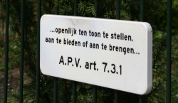
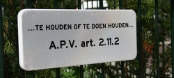
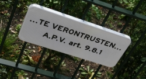
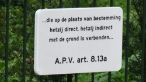
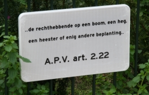
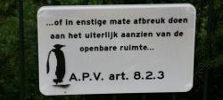

Voici quelques panneaux que j'ai découvert cet été en plus des panneaux habituel de [non-stationnement pour vélo](/velos-les-paneaux-aussi-se-mettent-a-la-couleur). J'ai pris en photo tous ceux que j'ai vu sur cette place et je n'arrive toujours pas à comprendre ce qu'il y a écrit dessus. J'aimerais avoir un petit coup de main pour traduire ces panneaux. Pouvez-vous m'aider ?

  
1: ...openlijk ten toon te stellen, aan te bieden of aan te brengen...

  
2: ...TE HOUDEN OF TE DOEN HOUDEN...

  
3: ...TE VERONSTRUSTEN...

  
4: ...die op de plaats van bestemming hetzij direct, hetzeij indirect met de grond is verbonden...

  
5: ..de rechthebbende op een boom, een heg, een heester of enig andere beplanting..

  
6: ...of in enstige mate afbreuk doen aan het uiterlijk ten aanzien van de openbare ruimte...

Envoyez vos traductions en français en commentaire et dans l'ordre des panneaux. Attention, je pense que la démarche est artistique il faut donc sûrement faire preuve d'originalité. Merci d'avance.
---