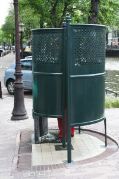

{.right}
Dans la ville qui a vu naître la heineken, il est courant de prendre [l'apéro dans la rue](/revisions-sous-le-soleil), [sur un bateau](/sortie-en-bateau) ou de [pique-niquer dans un parc](/le-vondelpark). 

La bière est une boisson durétique, on a tendence à l'oublier mais il arrive toujours un moment où notre vessie nous le rappelle. Il est parfois difficile de s'isoler quand on est dans la rue, un parc ou un bateau. C'est toute l'utilité de la **pissotière**, qu'on appelle aussi **vespasienne** (et *Krull* en néerlandais) et je ne sais vraiment pas pourquoi. Mobilier urbain à caractère très ancien ([aussi ancien que la bière ?](http://www.orgemont.com/fabrication.php)) les vespasiennes ne sont pas encore dépassées à Amsterdam et l'on en trouve encore plusieurs dans le centre ville. Elles sentent mauvais, elles prennent la place de précieux parkings à vélos et sont fréquentées par des mauvais garçons qui boivent mais elles sont aussi très appréciées comme le montre cette photo.

<!-- post notes:
http://www.theculturedtraveler.com/Archives/AUG2001/En_Pissant.htm
--->
