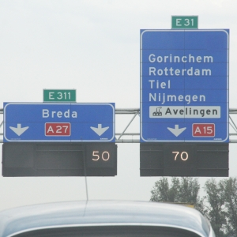

{.left}Puisque j'ai pris la route aujourd'hui, autant vous parler de route. 

Les autoroutes Néerlandaises sont truffées de grands panneaux noirs qui surplombent chaque voie. Ce sont des panneaux lumineux, la plupart du temps, ils ne sont pas allumés mais quand ils s'allument et affichent un grand chiffre, **la limitation de vitesse change** et il faut alors ne pas dépasser la vitesse indiquée sur le panneau lumineux. Généralement ces limitations sont là pour annoncer un embouteillage ou un incident sur la route.

Très souvent, la vitesse limite indiquée sur le panneau est la vitesse maximum que l'on peut atteindre sur la voie sur laquelle on se trouve. La circulation est tellement dense aux Pays-Bas que les embouteillages sont très fréquents (surtout le vendredi soir et dans [le Randstad](/le-randstad)). **La vitesse conseillée a aussi un rôle régulateur**.  Faire ralentir les usagers avant les embouteillages permet en fait de fluidifier le trafic. Tout le monde roule à vitesse réduite pendant quelques kilomètres pendant que plus loin sur la route, un bouchon se résorbe lentement. En roulant moins vite, on n'arrive pas plus tard parce qu'on s'arrête moins longtemps quand le trafic est bloqué. Je ne sais pas si c'est toujours efficace ni si les néerlandais sont très observateurs de ces signaux mais je n'ai pu que constater que la limitation qui était indiquée était très souvent adaptée aux conditions de circulation.

La seule chose à espérer aujourd'hui est de ne pas avoir trop de ces signaux sur ma route.
