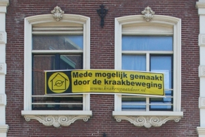

Samedi, il y a eu une [manifestation sur de Dam](http://www.flickr.com/photos/dumbfunk/269611801/) contre l'évacuation d'un squat. On vide souvent les squats quand il y a besoin des lieux pour les rentabiliser alors que peu de temps avant, on n'avait besoin que le lieu ne soit pas sur le marché immobilier pour ne pas le destabiliser... Un petit jeu du chat et de la souris rendu dernièrement plus violent sous la pression de la spéculation immobilière (voir [photo de Laurent Chambon dans le quartier du Pijp](http://laurentchambon.blogspot.com/2006/10/ballade-australovicienne-2.html)). 

{.left}
Je me souviens cet été des banderoles qui ont fleurit sur certains immeubles de la ville (voir ci contre). Ces banderoles disaient que le lieu existant n'aurait pas pu exister tel qu'il était sans avoir été auparavant squatés. Les salles de concert les plus prestigieuses comme le Paradiso ou le Melkweg arboraient ces banderoles... [Ce mouvement protestait contre une loi anti-squat](http://krakengaatdoor.nl/) discutée alors à la deuxième chambre, une loi très sévère pour les squateurs et la culture en général... Je n'en sait pas beaucoup plus parce que je ne maîtrise pas encore le Néerlandais, je ne sais pas ce qu'est devenu ce projet de loi. Toujours est-il que [les banderoles](http://www.talk2000.nl/mediawiki/index.php/Weggeefwinkels.nl) ont disparu et que certains squats se font évacuer près de la place du Dam...
