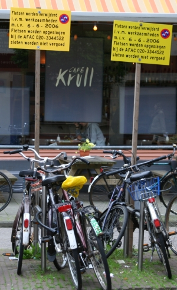

{.center}

Je suis dans une ville qui revendique autant de bicyclettes que d'habitants[^1] alors évidement il y a quelques aménagements spécifiques pour ce mode de transport. Vous connaissez surement les garages et les pistes réservées, vous avez vu la signalisation pour vélos mais vous êtes peut-être moins attentif aux interdictions de stationner qui fleurissent ça et là. Le panneau ci dessus indique qu'il est interdit d'attacher une bicyclette sur cette grille. Pour une fois l'interdiction est respectée. Beaucoup d'amstelodamois qui habitent au rez-de-chaussée aposent des autocollants sur leur fenêtres pour que [les bicyclettes](/tag/velo/) se garent ailleurs. Peine perdue, beaucoup de ces panneaux ne sont pas respectés.

{.center}

Le panneau jaune ci dessus[^2] est apposé à proximité du parking à vélos de la gare WTC Zuid. Il précise que le stationnement est autorisé pour une période inférieure à 28 jours. Si vous désirez partir en vacances en train et que votre congé est supérieur à 28 jours, il ne faut pas utiliser ce parking. Ci-dessous, en prévision de [travaux dans le quartier du Pijp](http://laurentchambon.blogspot.com/2006/10/sujet-du-moment-stationnement.html), un parking à vélos doit être supprimé temporairement. Les bicyclettes qui s'y parquent ont jusqu'au 6 juin pour aller ailleurs.[^3]

---
[^1]: J'ai lu quelque part que Amsterdam comptait 738 763 habitants pour 600 000 bicyclettes. Je ne sais pas comment les décomptes ont été faits ni si [mon B'twin](/un-b-twin-a-amsterdam) a été compté
[^2]: Je voulais faire un titre qui rappelle la [photo des vélos colorés](/les-velos-en-couleur) d'il y a quelques jours mais je n'ai que deux couleurs de panneaux ici...
[^3]: Si vous regardez bien, vous voyez un café juste derrière, je pense que vous savez [ce que signifie son nom](/pour-se-soulager-2)...