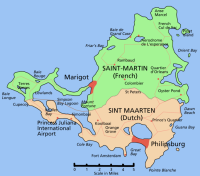

Les Pays-Bas et la France ne sont pas des pays limitrophes parce qu'un jour, des gens ont inventé la Belgique pour séparer le France des Pays-Bas. Pourtant, aujourd'hui encore, il existe une frontière terrestre commune entre les deux pays. Il faut pour cela aller aux Antilles...

[{.left}](http://nl.wikipedia.org/wiki/Afbeelding:Saint_martin_map.PNG)
L'île de Saint-Martin (ou *Sint Marteens*) est situé dans le nord des Petites Antilles. La partie nord est Française, c'est une commune du département de **Guadeloupe** mais son statut devrait évoluer en 2007. La partie sud est une partie des **Antilles Neerlandaises** qui font partie du royaume des Pays-Bas sans être une partie de ''l'État Pays-Bas'' qui se limite à la partie européenne du Royaume[^1]. Au sud de l'île, le statut devrait aussi évoluer en 2007 suite à une évolution administrative des Antilles Néerlandaises. Je pense que je reparlerais de ces îles une autre fois.

Cette petite île européenne des Antilles, est la seule île de toutes les Caraïbes traversée par une frontière internationale. Les contrôles à cette frontière sont inexistants et les douaniers officient sur les deux aéroports de l'île mais la séparation se voit parraît-il plus par le développement touristique qui n'est pas le même des deux cotés[^2]. Cette frontière existe officielement depuis 1648. Elle a été traçée par les [accords de Concordia](http://fr.wikipedia.org/wiki/Accords_de_Concordia) à la suite du départ des espagnols de l'île. Les Néerlandais et les Français restés sur Saint-Martin (*Sint Maartens*) à l'époque ont eu la bonne idée de vivre en paix sur cette île.
---
[^1]: Je sais, ça peut paraître compliqué mais je crois que les Néerlandais ne comprennent pas non plus nos DOM qui sont aussi des ROM et nos POM qu'on continue d'appeler des TOM...
[^2]: Les Néerlandais ont développée une activité économique de port franc qu'on ne retrouve pas sur la partie nord de l'île.