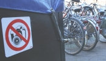

Je ne suis toujours pas en prison mais après avoir été inscrit sur les [registres des impots](/sophie-pas-numero) et le [registre de la mairie](/mes-premiers-pas-comme-immigre), me voici maintenant sur le registre de la police. J'ai fait un truc interdit mais je ne savais pas que c'était interdit...

## Contexte de l'infraction
Je rentrais tranquilement de WTC Zuid en vélo après avoir signé mon contrat d'embauche. Pour fêter ça, je me suis voté un petit détour par RAI et Beatrixpark. Vu [le beau temps](/le-temps-de-gate) je me suis arrêté à plusieurs endroit pour prendre des photos.

## Un chouette quartier qui a l'air bien sécurisé
Au bord du Beatrixpark, le long de Diepenbrocktraat il y a un joli quartier avec de belles villas et surtout trois grosses villas dont le jardin fait concurence au parc à coté. Il y a [une maison vraiment impressionante](http://maps.google.com/?q=Amsterdam&ie=UTF8&om=1&z=19&ll=52.344821,4.882677&spn=0.000631,0.002682&t=h) en plein Amterdam, je la prend aussi en photo. Moins d'une minute plus tard je suis interpellé par un policier qui descend d'une voiture à mon niveau. il me pose tout plein de questions sur ce que j'étais en train de faire avec mon dangereux appareil photo dans la main.

## C'est pas bien mais je savais pas
{.left} Après un questionnaire détaillé sur mes intentions, contrôle d'identité et tout ça, le constable m'informe que j'ai pris en photo la résidence d'un fameux défenseur de la cause palestinienne et que je n'ai pas le droit de le faire ([Il n'y a que Google qui a le droit](http://maps.google.com/?q=Amsterdam&ie=UTF8&om=1&z=19&ll=52.344821,4.882677&spn=0.000631,0.002682&t=h)). Il me fait effacer la photo de mon appareil et m'indique que cet indident ainsi que mon identité seront enregistrés dans les dossiers de la *politie*. Me voilà donc fiché comme potentiel faux-touriste-agent-du-Mossad.

Rien de bien grave en fait mais je tenais à vous raconter cette anecdote pour vous montrer comment c'est difficile parfois de trouver des illustrations original pour ce blog; et ainsi vous donner des nouvelles de moi à Amsterdam.
