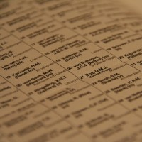
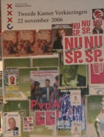

{.left}Distribué «toutes boîtes» la liste des candidats pour **les prochaines élections générales** aux Pays-Bas ne peut maintenant plus être ignorée des gens qui lisent leur courrier. Les étrangers ne participent pas au vote puisque c'est une élection nationale mais [ceux qui s'interessent à la politique](http://laurentchambon.blogspot.com/2006/11/en-campagne-lectorale-sur-le-march.html) peuvent prendre connaissance des listes en présence, des candidats qui y figurent et de leur ville d'origine.
 
{.right}
Depuis quelque temps maintenant **la campagne fait rage aux Pays-Bas**. [Je vous en ai déjà parlé](/election-j-30) avec le peu que je connaissais. Maintenant je peux enfin vous donner la liste complète des candidats. Surtout, je pourrais vous donner la liste complère des 22 listes qui vont s'affronter le 22 novembre prochain, avec les noms des candidats et tout, tout ça pour remplir votre écran... mais je ne vais pas le faire puisque [les listes sont sur wikipedia FR](http://fr.wikipedia.org/wiki/%C3%89lections_l%C3%A9gislatives_de_novembre_2006_%28Pays-Bas%29). Sur le dépliant que j'ai dans les mains, il n'y a pas de liste numéro 21 (*lijst 21*) ni la 22 (''Tamara's Open Partij'') ; je ne peux pas vous dire pourquoi.

Le dépliant explique aussi comment se déroule le vote. Le gros point de différence avec la France est **l'utilisation de machines à voter**[^1]. Enfin, une liste de tous les bureaux de vote à Amsterdam est fournie avec une adresse précise pour ne pas se gourer. Les Autochtones néerlandais sont maintenant parés pour voter. Reste à faire leur choix.

---
[^1]: Je ne ferais aucun commentaire sur la fiabilité de ces machines. Il est de notoriété publique que des machines à voter «propriétaires» ne peuvent pas garantir la confidencialité ni la sécurité du scrutin.