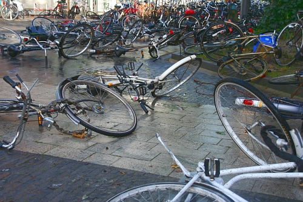

## Temps de chien

Ce n'est pas peu dire que de raconter que le temps se gâte. Les températures sont tombées brusquement depuis le passage à l'heure d'hiver et le vent du nord s'est mis à prendre de la vitesse. Depuis lundi les averses se succèdent à un point qu'il n'est plus possible de sortir sans parapluie[^1]. Ces averses pluvieuses se sont transformées en averses de gresil dans la nuit et, l'après-midi de mardi, ce sont les grelons qui tombaient. Je ne sais pas jusqu'où ça va continuer ni même si je vais pouvoir tenir...

## Pas de pitié pour les équilibres

Comme il pleut comme vache qui pisse et qu'il y a un vent à décorner les bœufs, il n'est pas très possible de poser quoi que ce soit en équilibre dans la rue. J'ai du mal à prendre des photos bien cadrées sans bouger et [les vélos](/tag/vélo) appuyés sur leurs béquilles se retrouvent par terre. Les cadavres de vélos jonchent le sol à proximité des gares et des magasins. C'est pour vous montrer ce paysage désolé, ce cimetière de vélos que je vous parle de la pluie et du --beau temps-- mauvais temps...

{.center}

Le vent a aussi [un effet sur les avions](/les-avions-bas).

En savoir plus sur [les vélos morts](/Les-velos-morts)

---
[^1]: En néerlandais on dit *paraplu*