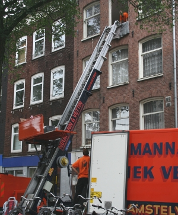
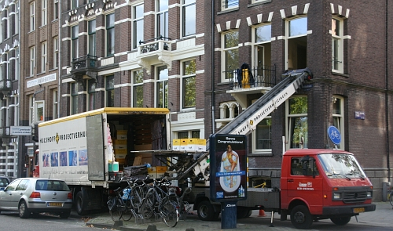

{.left}
Je vous ai parlé [du crochet (de haak)](/de-haak-crochet) qui surplombe presque toutes les maisons Amstelodamoises. Je vous ai dit que c'était indispensable pour déménager. Vu l'étroitesse et la raideur des escaliers, les meubles ne peuvent que passer par les fenêtres. Il faut alors un crochet et des gars forts pour tirer sur la corde pour monter les meubles à la fenêtre.

Je ne vous ai pas dit que ce fameux crochet a fait l'objet d'une [discussion sur le forum des hollandais](http://www.leforum.nl/phpBB/viewtopic.php?t=4585&start=0&postdays=0&postorder=asc&highlight=crochet). Il semblerait que les assurances ne couvrent pas l'utilisation de ce crochet. Sûrement parce qu'il y a eu quelques accidents suite à une mauvaise utilisation de ce dernier. Les forumeurs les plus au courant indiquait que les déménageurs les plus avisés utilisaient une platte-forme pour monter les meubles (et les descendre aussi).

Je confirme que j'ai vu des professionels déménager un canapé avec une poulie, je pense que ces derniers doivent être au courant le la masse limite des meubles qui peuvent utiliser le crochet avec la poulie. Je confirme aussi que **les déménageurs futés utilisent un monte-charge** pour passer les meubles, toujours par la fenêtre. C'est moins fatiguant et plus sûr. Par contre, ça demande une occupation de la chaussée plus importante; mais comme pour les gros déménagements, il faut garer un gros camion à proximlité, les déménageurs futés disposent de camions équipés de ces monte-charge.

{.center}
---