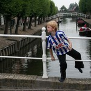
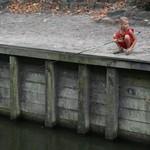

Puisque vous avez aimé les photos des enfants d'[Amsterdam](/marie-heineken-est-fan-de-l-om) et de [Naarden](/tous-derriere-la-balle), je vous propose maintenant de voir les enfants de Sloten. [Sloten](http://www.sloten.nl/) est aussi[^1] un petit village de Frise que l'on appelle *[Sleat](http://fy.wikipedia.org/wiki/Sleat)* en frison[^2]. Comme je ne parle pas frison, je n'ai pas pu converser avec ces enfants pour leur demander ce qu'ils faisaient. Je les ai juste pris en photo, à vous de comprendre ce qu'ils faisaient...

[|http://www.flickr.com/photos/13274211@N00/278973675/] Jeune footballeur de Frise

[|http://www.flickr.com/photos/13274211@N00/278973676/] Jeune pêcheuse

Ces photos peuvent compléter celles prises le même jour. Jour de [voile en Frise](/zeilen-in-friesland).
---
[^1]: Je dis «aussi» parce que Sloten est le nom d'[un quartier d'Amsterdam|http://fr.wikipedia.org/wiki/Sloten].
[^2]: Ce village est situé sur la commune de [Gaasterland-Sloten|http://fr.wikipedia.org/wiki/Gaasterland-Sloten]