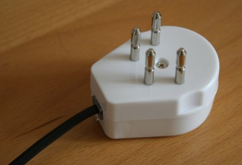

{.left}
Lorsque j'ai rapporté mon téléphone de France, j'ai pris avec moi les prises et ralonges téléphoniques que j'avais en France ainsi que les filtres ADSL parce qu'on ne sait jamais. Il a fallut changer.

Le téléphone transporte notre voix sur deux petits fils mais chaque pays a fixé une norme en pensant ensuite la faire évoluer. En France, nos prises gigognes peuvent avoir jusqu'à 8 contacts mais il n'y en a que deux d'utilisés. Aux Pays bas, une prise téléphone ressemble beaucoup à une prise électrique sauf qu'il y a ici quatre pointes. Seules les deux pointes du haut sont utilisées les deux autres sont vraisemblablement là pour ne pas confondre cette prise avec une prise électrique.

La solution a été de reprendre mes [cables RJ11](http://resnet.salisbury.edu/images/ethernet_phone.jpg) et d'acheter des adaptateurs téléphone/RJ11 locaux (voir photo ci-contre) ce qui est quand même plus efficace que d'attendre Noël qu'on m'offre un nouveau téléphone.

* voir aussi [Les téléphones sans prise (GSM aux Pays-Bas)](/telephones-gsm-pays-bas)
