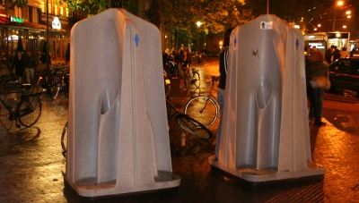
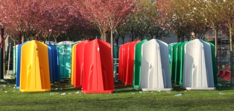

Plus modernes que les [pissotières (ou ](/pour-se-soulager-2)*[krull)](/pour-se-soulager-2)*, il traine parfois dans les rues de curieux urinoirs dont je ne connais pas le petit nom[^1]. Ces sont de grands moulages en plastique avec un large socle. Dans chacun des quatre angles rentrants, un petit trou grillagé tient lieu d'urinoir. Les armatures de part et d'autre du trou font office de cloisons rudimentaires. Un petit bonhomme dessiné sur l'objet indique qu'il s’agit ici de **pissotières pour hommes**.

{.center}

Ce nouveau genre de mobilier urbain moderne est déposé à proximité des lieux de sortie au début du week end. Ils sont très utilisés parce que c'est dans ces lieux de sortie que l'on boit le plus de bière[^2]. On peut juger que c'est sale et malodorant mais cela semble réduire efficacement le nombre de personnes qui vont pisser contre les murs des maisons dans les coins sombres (ce qui est encore plus sale et plus malodorant). 

Au petit matin, ces objets sont retirés pour être vidés et nettoyés. Je ne sais pas trop comment ça se passe mais cet été quelques uns d'entre eux étaient entreposés à proximité de Museumplein. Une drôle exposition d'art plastique avant la rénovation du musée Stedelijk.

{.center}

voir aussi:
* [Pour se soulager (1)](/pour-se-soulager-1)
* [Pour se soulager (2)](/pour-se-soulager-2)
* [Pour se soulager (4)](/pour-se-soulager-4)
---
[^1]: Nous les appellerons bac-à-pipi.
[^2]: Alors que l'important, ce n'est pas de boire beaucoup de bière, c'est de boire [de la bonne bière](http://www.orgemont.com/).
<!-- post notes:
http://myvag.net/pee/standing/
--->
