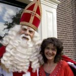
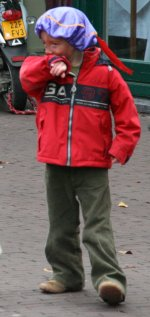

[{.right}](http://static.sinterklaasjournaal.nps.nl/img/meer/dagplaatje5_groot.jpg)
Le **Père Noël** a plusiqurs sous-traitants pour assurer sa distribution de jouets au monde entier. En Espagne, les rois mages distribuent les cadeaux début janvier alors que dans le nord de l'Europe, Saint Nicolas distribue les cadeaux avant qu'il fasser vraiment trop froid. Aux Pays-Bas, c'est **Saint Nicolas** qui a eu le contrat de distribution des cadeaux. Les enfants comme les adultes l'appellent **Sinterklass**.

Aux Pays-Bas, il dépose ses cadeaux le 5 désembre. Il part en Belgique juste après où les cadeaux sont déposés le 6 décembre. Le travail ne se fait pas en une nuit. Il est longuement préparé et Sinterklaas fait le tour du pays depuis samedi pour rencontrer les enfants afin de ne déposer des cadeaux que chez ceux qui ont été sages. La télévisions nationnale relate les évènements dans [un journal spécial](http://sinterklaasjournaal.nps.nl/) qui est diffusé sur tous les soirs la télévision nationnale. C'est un évènement de première empleur.

Sinterklass viens tous les ans, avec sa grande barbe blanche et sa mithre depuis l'Espagne sur un bateau à vapeur qu'on appelle **pakjesboot** (le bateau des petits paquets)[^1]. Cette année [il a débarqué à Middelburg](http://www.middelburg.nl/internet/sint/intocht.html) en Zélande. La télé était là ainsi que des familles venus de tous les Pays-Bas pour voir l'une des personnalités les plus connues tu pays. Sinterklaas est toujours entouré de ses nombreux assistants du nom de **Zwarte Piet**. Ces assistants ne sont pas très malins et font parfois des bétises mais ils aident Sinterklaas dans sa lourde tâche de distribution des cadeaux.

{.left}
Dimanche, toute la troupe était en tournée à Amsterdam. Les enfants étaient venus de partout pour voir Sint' et nombreux étaient déguisés en Zwarte Piet ce qui leur donnaient une excuse pour faire le pitre. Les rues étaient bloquées et les trams détournés pour laisser passer le curieux cortège. Les enfants recevaient des petits drapeaux à l'éfigie de Sinterklaas et des **pepernoten**.

En suivant **le journal de Sinterklaas**, j'ai découvert comment la distribution des cadeaux aux enfants était un travail difficile. On apprend ainsi qu'après avoir évité une colision avec un arc-en-ciel, Sinterklaas n'a pas trouvé Middelbrug du premier coup. Il est repartit ensuite dans la bonne direction mais il a laissé sur terre un Zwarte Piet en charge du livre de Saint Nicolas (**Het grote boek**). Ce dernier a réussi à retrouver Sinterklaas en prenant un hélicoptère à un arrêt de bus mais le *grote boek* a été oublié sur l'arrête de bus. C'est un incident très grave parce que ce livre contient le nom de tous les enfants qui ont été sages et que Sinterklaas doit livrer. Zwarte Piet est bien le descendant du père fouetard et continue de faire flipper les enfants. La présentatrice du journal explique qu'il va être difficile pour Sinterklaas de livrer tous les enfants méritants s'il ne retrouve pas son satané bouquin... Pour connaitre la suite, vous pouvez [suivre l'emission sur le web](http://sinterklaasjournaal.nps.nl/journaal_alle.php).

### En lire plus:
* [Qui es-tu Zwarte Piet ?](/qui-est-tu-zwarte-piet)  
* [Saint-Nicolas est revenu (Sinterklaas is terug)](/saint-nicolas-est-revenu-sinterklaas-is-terug)  
* [Sinterklaas op de Dam, il est toujours là](/sinterklaas-op-de-dam-il-est-toujours-la)  
* [Sinterklaas, ou simplement SINT](/sinterklaas-sint)  
* [Le passage de Sinterklaas](/le-passage-de-sinterklaas)
* [Où vas-tu Zwarte Piet ?](/ou-va-Zwarte-Piet)

---
[^1]: Le véritable nom de ce bateau est **Pakjesboot 12**. Sinterklaas a utilisé d'autres bateaux en 1993 pour débarquer à Ravenstein avec le *Succes* dit *pakjesboot 13* et en 2001 à Maastricht avec le *Marie C* dit *pakjesboot 13*. Les voies d'eaux pour accéder à ces villes étant trop étroites pour le bateau habituel de Sinterklaas.