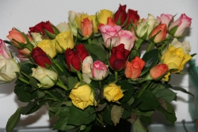
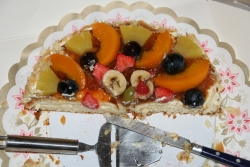
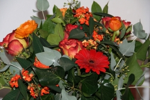

<table><tbody><tr><td style="vertical-align:top;">

<strong>Les anniversaires sont très importants aux Pays-Bas</strong>, <a href="http://annevickycarlier.blogspot.com/2006/08/verjaardag-van-maxim-lanniversaire-de.html">Anne-Vicky nous le rappelle sur son blog</a>, c'est un moment incontournable de la vie. L'oublier est une insulte et tant pis pour les distraits.

Vendredi c'était l'anniversaire de Sophie et comme ce n'était pas un jour férié, il a fallu qu'elle le partage avec ses collègues. Ces derniers ont apporté des petits cadeaux et ont même offert un joli bouquet de fleurs (celui du haut). Sophie a apporté des gâteaux pour tout le monde. Tout le monde a chanté <em>joyeux anniversaire</em>[<a href="#pnote-130-1" id="rev-pnote-130-1">1</a>].

C'était un anniversaire spécial. Sophie a vu les 36 chandelles et les autre traditions ont suivit. Cartes de vœux à l'anglaise et coups de fils à la téléphonique, rien ne manquait. J'ai même failli envoyer promener le livreur du joli bouquet de roses que <a name="http://sophie.fodil.co.uk/fruit/?image=img_1495-Echenevex.jpg" title="photo de nous 3">Agnès</a> nous a fait parvenir. Pour le reste, inutile de vous dire qu'on a profité de cette date pour allonger notre liste des bons restos d'Amsterdam.

</td>
<td style="vertical-align:top; min-width:200px;">

{.right}
{.right}
{.right}

</td></tr></tbody></table>

<h4>Notes</h4>

[<a href="#rev-pnote-130-1" id="pnote-130-1"> 1 </a>] voir ci dessous les paroles en Néerlandais

> Lang zal hij leven
> Lang zal hij leven
> Lang zal hij leven in de gloria
> In de gloria