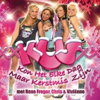

## Nouveau mot : Kus

[{.right}](/public/images/scans/KUS-kerst.jpg)
**Kus** veut dire **bisou**. Je vais attendre le jour de l'an pour vous promettre des bisous. Pour le moment, je vais vous parler d'un nouveau groupe qui s'appelle Kus et qui m'était inconnu jusqu'à il y a quelques jours. Quand j'ai découvert, je me suis vraiment dit que j'avais raté quelque chose...

## Au sujet de mon nouveau boulot (3)
[Je fais des pages web](/de-mon-boulot) qui permettent aux gens de demander des sonneries de téléphones. Avec la nouvelle mode des *realtones* (comme des *ringtones* mais en *real*), on peut demander aux plus grands chanteurs de faire chanter son mobile. Je découvre donc plein de groupes immanquables en réalisant mes pages web. **Kus** est l'un d'eux. Les --péta-- chanteuses de ce groupe vous sourient sur la pochette ci-contre.

## En avant la musique
Cette année la chanson de Noël est en Néerlandais : **KUS : Kon Het Elke Dag Maar Kerstmis Zijn**
''Je n'arrive pas a faire fonctionner ce player autrement que dans [Firefox](/pays-bas-adoption-de-firefox)... désolé''
<!-- HTML -->
<object type="application/x-shockwave-flash" data="/me-in-amsterdam//ecrire/tools/dotsound/player/dewplayer.swf?son=/me-in-amsterdam/share/dotsound/kus-kerst.mp3&autoplay=" width="450" height="25">
<param name="chanson" value="/me-in-amsterdam//ecrire/tools/dotsound/player/dewplayer.swf?son=/me-in-amsterdam/share/dotsound/kus-kerst.mp3" />
<param name="bgcolor" value="#e1d6cf" />
</object>

<!--
## Vous aussi...
Téléchargez [la Chanson de Kus en sonnerie de téléphone](http://www.celldorado.com/NL/ADS/179982235/)
-->
<!-- / HTML -->

<!-- post notes:
- [la même en sonnerie de téléphone|http://100real.nl/realtones/kus-en-rene-froger/kon-het-elke-dag-maar-kerstmis-zijn/index.php]
--->
