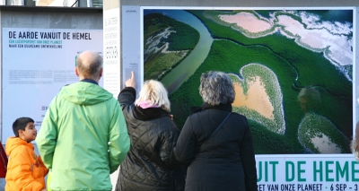

### Yann Arthus Bertrand à Waterloo

<!-- HTML -->
Le célèbre photographe est à Amsterdam depuis le mois de septembre et y montre quelques unes de ses plus belles photos de la série <b>La terre vue du ciel</b>. Cette exposition en plein air se termine juste avant qu'il fasse trop froid; le 3 décembre prochain. Si vous ratez cette expo; il vous restera à <a href="http://www.yannarthusbertrand.com/yann2/affichage.php">contempler les photos sur le web</a>
ou bien à  <a href="http://ad.zanox.com/ppc/?8910668C596726294T&ULP=[[http://livre.fnac.com/a1673900/Yann-Arthus-Bertrand-La-Terre-vue-du-ciel">acheter le bouquin</a>.
<!-- / HTML -->

{.center}
