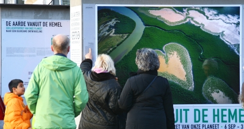

### Yann Arthus Bertrand à Waterloo

Le célèbre photographe est à Amsterdam depuis le mois de septembre et y montre quelques unes de ses plus belles photos de la série **La terre vue du ciel**. Cette exposition en plein air se termine juste avant qu'il fasse trop froid; le 3 décembre prochain. 

{.center}

Si vous ratez cette expo, il vous restera à [contempler les photos sur le web](http://www.yannarthusbertrand.com/yann2/affichage.php) ou bien à [acheter le bouquin](https://www.awin1.com/cread.php?awinmid=12665&awinaffid=297165&clickref=arthus-bertrand&ued=https://www.fnac.com/a9925349/Yann-Arthus-Bertrand-La-Terre-vue-du-ciel-nvelle-ed).

