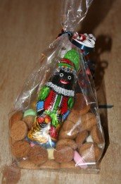

{.left}
Hier soir, c'était *pakjesavond* nous avons fêté la Saint-Nicolas (*[Sinterklaas](/sinterklaas-est-arrive)* pour ceux qui ne suivent pas) en une petite soirée tranquile. Pour respecter la tradition[^1], nous avons mangé des *pepernotten* (voir illustration[^2]) et des [lettres en chocolat](/les-lettres-en-chocolat). Il n'y avait plus trop de place ensuite pour manger ce gros bonhomme en speculos de 300g alors nous avons préféré ouvrir une bouteille de champagne. Je ne sais pas si ça fait vraiment parti de la tradition Hollandaise d'ouvrir  une bouteille de champagne. C'est plutôt une habitude française. Mais bon, c'était aussi l'anniversaire de nos deux ans alors comme c'est un évènement complètement français, ça vallait bien une bouteille de champagne...

J'ai maintenant fini de vous gaver avec Sinterklaas. La prochaine fête aux Pays-Bas c'est Noël, fête religieuse et surtout commerciale que les enfants attendent peut être moins que Sinterklaas. les 25 et 26 décembre sont quand même feriés ici.

((/public/images/photos/2006-12/lettre-S-en chocolat-100.jpg|lettre S en chocolat Verkade|C|lettre S en chocolat Verkade))

Voir aussi[^3]
---
[^1]: [Le blog d'Anne-Vicky](http://annevickycarlier.blogspot.com/2006/12/sinterklaas-st-nicolas.html) est très bien fait pour nous rappeller ce qui se fait à *pakjesavond*.
[^2]: Le [Zwarte Piet](/qui-est-tu-zwarte-piet) dans le sac est en chocolat, les petits biscuits ronds au goût de spéculos sont des *pepernotten*, on pourrait traduire ça par «noix épicées» ou bien encore «crottes en spéculos»...
[^3]: [Saint-Nicolas est revenu (Sinterklaas is terug)](/saint-nicolas-est-revenu-sinterklaas-is-terug) en 2007 (avec des photos).