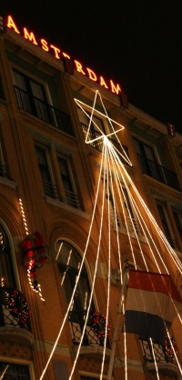

## Nouveau mot: Kerst

Ça veut dire **Noël**. On trouvera aussi la traduction *Kerstmis* ou *kerstfeest*qui désignent plus spécialement la [fête de Noël](http://vandale.nl/gratis-woordenboek/nederlands/betekenis/kerstfeest) (*het feest van de geboorte van Christus, op 25 dec*).

{.right}
Comme beaucoup, je profite de ces quelques jours de vacances pour fêter Noël. Les Pays bas ont déjà fêté les cadeaux avec [Saint Nicolas](/la-saint-nicolas-a-la-maison) mais la fête chrétienne de Noël n'en est pas moins fêtée. Comme partout la fête commerciale tend à prendre le dessus mais sans cadeaux parce que deux fois dans le mois c'est quand même trop.

## Kerst avond
La veille de Noël, le réveillon avec la messe de minuit. D'après ce qu'on m'a dit, ce sont les catholiques qui s'y prennent le plus la veille. **Le 24 décembre est férié au Limburg et dans le Brabant septentrional**, les provinces à [dominante catholique](/catholiques-et-protestants).

## Eerste Kerst
Le jour de Noël est férié aux Pays-Bas comme dans de nombreux pays d'Europe. Les Néerlandais protestants et catholiques fêtent la naissance du Christ. Les autres fêtent le retour de la lumière et en profitent pour se faire un bon repas en famille. Ce repas en famille est le point culminant de Noël dans la culture néerlandaise.

## Dweede Kerst
Le 26 décembre, lendemain de Noël est aussi férié, comme au Royaume-Uni où l'on fête *boxing day*, l'ouverture des cadeau. Ici, point de cadeau mais un deuxième jour pour continuer à faire de bons repas en famille. On appelle ce jour **le deuxième Noël**. Les enfants peuvent ainsi fêter Noël avec leurs grands parents paternels un jour et les maternels le lendemain. Il y a souvent beaucoup de monde sur la route à cette occasion.

Ainsi les Néerlandais ne se souhaitent pas un joyeux Noël mais plutôt de joyeux jours de Noël : *Prestige Kerstdagen*. **Très bonnes fêtes de Noël à tous**!

