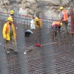
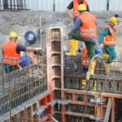
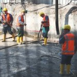
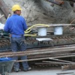

En vous présentant la [ligne Noord-zuidlijn](/la-ligne-du-nord-au-sud) et la [Ceintuurbaan station](/noord-zuidlijn-ceintuurbaan-station) qui s'appellera peut être **de Pijp**, je pensais vous faire un reportage sur les travaux que l'on peut observer en longeant Ferdinand Bolstraat. La station sera là à l'ouverture de la ligne en 2013. Si je ne le fais pas ici, je ne vous montrerais jamais ces travaux. Voici donc une des photos du chantier cet été :

Maintenant, il n'y a plus de travaux, le chantier s'est refermé et les ouvriers ont recouvert la chaussée de dalles. Cette portion de route est dévolue au piétons, il y a même des bancs pour s'assoir. Cela fait moins d'un mois que cette rue offre un nouveau visage plus acceuillant et je suis certain que les commercants qui ont les boutiques à cette adresse en sont tous très content.

Maintenant nous sommes en décembre et l'échéance du 25 se marque de plus en plus autour de nous. Amsterdam va fêter Noël et les commerces espèrent bien nous faire notre fête au plus vite. Ce petit tronçon de *Ferdinand Bolstraat* bien que tout beau et tout neuf s'est aussi parré des lumières de Noël comme toute rue commerceante. Je vous ne résiste pas au plaisir de vous montrer une photo de ce qui n'était qu'un chantier cet été.

{.center}
---