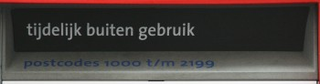

Bientôt le nouvel an. Partout dans le monde cette date marquant le changement d'année est fêté. Le réveillon de la Saint Sylvestre s'appelle ici le réveillon de l'ancienne année *Oudejaarsavond*. Au menu, des plats de fête, des soirées chez des amis ou dans la rue. Depuis quelques jour, on a l'impression que la chasse est ouverte à Amsterdam, les pétards retentissent de partout et le son résonne contre les facades des maisons.

Il semblerait que les Amstelodamois, comme les chinois, fêtent le nouvel an avec des pétards et des feux d'artifice (*vuurwerk*). Les boutiques spécialisées vendent tout ce qu'il faut pour faire son feu d'artifice chez soi et comme beaucoup d'Amstelodamois [vivent dans la rue](/revisions-sous-le-soleil), on a droit à quelques feux d'artifice privés en spectacle, pour se préparer à la fête du 31. Ça promet.

{.center}
<!-- HTML -->

boite aux lettres hors service par peur des pétards

<!-- / HTML -->
La soirée du 31, pour vous dire si elle tient ses promesses, on attendra l'année prochaine. D'ici là, je vous souhaite de passer un **bon reveillon de la Saint Sylvester**.

Pour en savoir plus sur les pétards aux Pays-Bas : voir les [préparatifs pétaradants](/preparatifs-petaradants).

**Quelques liens du nouvel an :**  
[Gueule de bois ?](/gueule-de-bois)  
[Nouveau mot : Gelukkig](/liens-pour-nouvel-an)  
[Il y a eu des dégats](/il-y-a-eu-des-degats)  
[Un plongeon pour le nouvel an](/un-plongeon-le-nouvel-an)  
[Les bruits du nouvel an](/les-bruits-du-nouvel-an)  
[Deux nouvelles années](/deux-nouvelles-annees)  
[Pour les vœux, c'est fini](/pour-les-voeux-c-est-fini)  
[1er jan 2011, les Pays bas perdent 3% de leurs communes](/les-pays-bas-perdent-de-leurs-communes)  
---