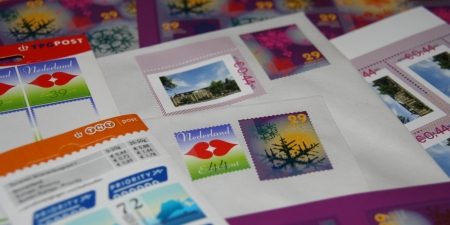

«**Augmentation du prix du timbre**» Cette phrase souvent prononcée par les journalistes qui annoncent l'augmentation des tarifs postaux n'est pas dénuée de sens aujourd'hui. En effet, nous avons vu qu'aux Pays-Bas, l'[unité de base pour l'affranchissement des lettres, est le timbre](/les-tarifs-postaux) et que plus le pli est lourd, plus il faut mettre de timbres. Cette unité de base qu'est le timbre a prit quelques centimes au 1er janvier 2007. Comme le prix d'un timbre n'est pas très élevé, les augmentations sont toujours spectaculaires. 12% d'augmentation pour les courriers à destination des Pays-Bas (de 0,39€ à 0,44€) et 5% pour les courriers à destination de l'Europe (de 0,69€ à 0,72€)... [Les prix détaillés sont disponibles ici](http://www.tntpost.nl/voorthuis/brieven-en-kaarten/tarieven/)

<!--excerpt-->

Cette augmentation a traditionnelement eu lieu au 1er janvier et [TNT post](/la-poste-prends-les-couleurs-d-halloween) a profité de l'occasion pour ajouter son logo sur les nouveaux carnets de timbres. **TPG post n'existe plus!** L'année dernière, les timbres pour l'Europe proposaient 5 visuels différents mais cette année il n'y en a qu'un. Ce sont les carnets de timbres pour les Pays-Bas qui proposent des visuels différents en 2007.

{.center}

## Les timbres discount de Noël
Pour la période des fêtes, la tradition est d'écrire des cartes. Les français (comme moi) souhaitent souvent la bonne année une fois que cette dernière est commencée. Les Néerlandais suivent plutôt l'exemple anglais et écrivent avant Noël pour souhaiter de bonnes fêtes pour tout. Il y en a peut-être même qui écrivent pour la Saint-Nicolas... A cette occasion, et pour l'envoi de v?ux uniquement, TNT post propose des tarifs avantageux avec des timbres adaptés. Ainsi, des planches de **timbres à 0,29€** sont sorties en novembre pour que les Néerlandais puissent envoyer leurs vœux par la poste. Ces timbres sont valables du 20 novembre 2006 au 15 janvier 2007 pour les envois ne dépassant pas 20g à destination des Pays-Bas.

Je n'ai évidemment pas pu profiter de cette offre pour **envoyer mes cartes de voeux en France** mais j'ai quand même utilisé ces timbres pour que vous puissiez profiter d'un affranchissement plus varié que l'unique visuel des timbres à 0,72€. D'ailleurs je n'ai pas fini mes envois alors je vais devoir arrêter ici ce billet pour continuer à écrire mes cartes...
