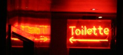
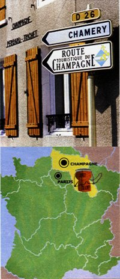

Les cafés, restaurants et magasins de nourriture on souvent envbie d'ajouter des mots français dans leur cartes ou leur présentation. Surremment veulent-il faire croire que les produits vendus sont français et que ce sont donc des produits de luxe et de bonne qualité. Je pense que que ce genre d'association ne trompe personne, ni en France ni ailleurs. Mais comme ce genre de publicité est souvent utilisé, il est amusant de voir le nombre d'erreur qui sautent alors aux yeux du français que je suis. Le dernier en date est le «toilette» au singulier dans un pub pour désigner les toilettes.

{.center}

Plutôt que de vous faire une liste d'exemple, je vous renvoie au [billet «Baket ou baguette» de Laurent Chambon](http://kreukreuscopie.blogspot.com/2006/10/un-baquet-ou-une-baguette.html) et [la suite avec preuve par l'image](http://kreukreuscopie.blogspot.com/2007/01/baquet-la-suite.html).

{.right}
Un autre site est interessant pour les fautes d'anglais que commettent ces grands admirateurs des États-Unis. [Dunglish](http://www.dunglish.nl/) est un site animé par une ... francophone d'Amsterdam. Elle est Canadienne, traductrice et DJ et s'appelle Natasha et je parlerais plus longuement d'elle un autre fois et je vous laisse vous amuser avec son site Dunglish.

Autre erreur amusante découverte à l'occasion de Noël, dans le Magazine d'[Albert Hein](/albert-hein-et-compagnie) qui consacrait un dossier fort à propos sur le champagne... Cette carte de France si contre est un chef d'?uvre. La région «Champagne» va de la Somme à la Haute-Marne en passant par les Ardennes et la capitale, qui s'appelle Champagne doit se situer près d'Amiens# le découpage des régions semble avoir été fait par un fénéant qui trouvait plus simple de regrouper les Normandies, le Centre et les Pays de Loire ainsi que toutes les régions du Sud-Ouest-Midi-Aquitaine- -Pyrénées-Langedoc-Roussillon. Par contre la Côte d'Azur est bien disticte de la Provence comme tout le monde le sait.

J'ai d'abord voulu écrire au journal, leur montrer qu'ils étaient nuls. Puis expliquer à tous les Néerlandais les véritables choses de la vie, qu'il n'y a pas besoin de lire Voici pour savoir qu'on ne fait pas de Champagne à Beauvais ni à Charleville-Mézières. Puis je me suis souvenu que je ne connaissais aucune région des Pays-Bas avant de venir ici et que quitte à donner des leçons, je devrais plutôt le faire  dans la langue de mon interlocuteur. Voilà pourquoi le prochain article de ce blog vous présentera [les régions des Pays-Bas](/les-provinces-des-pays-bas), qu'on appelle ici provinces.
---