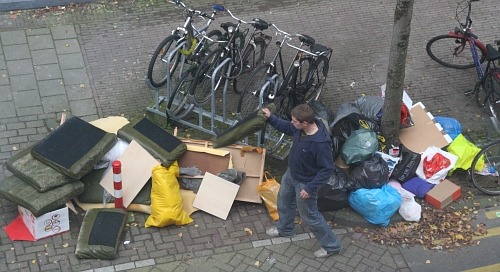
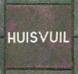
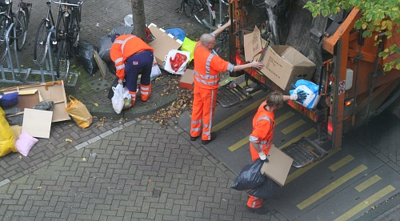

On attribue à [Eugène Poubelle](http://fr.wikipedia.org/wiki/Eug%C3%A8ne_Poubelle) l'invention qui porte son nom. Cette invention très salubre s'est démocratisée dans de nombreuses villes en dehors de Paris. À Amsterdam, le ramassage des ordures se fait bien avec des camion-poubelle mais sans poubelle.

{.center}

{.left}Dans la Capitale du [pays le plus en avance d'Europe pour le tri sellectif](http://www.cercle-recyclage.asso.fr/publi/dossiers/materiaux/transpositions04.htm), la poubelle n'existe pas. Les ordures sont donc déposées à même le trottoir en des endroits désignés par l'inscription *HUISVUIL*. Les amstelodamois savent bien ce qu'est une poubelle, mais pour eux c'est un récipient privatif et aucune loi n'impose au gérants d'immeubles de mettre des poubelles à disposition des occupants. Ceci peut parraître logique dans une ville où il y a quatre foyers maximum dans la plupart des maisons...

{.center}

Les tas d'ordures dans des sacs divers au petit matin donnent une vision un peu anarchique de la gestion des déchets mais ils faut connaitre les quelques regles de base concernant les ordures ménagères si on ne veut pas, là aussi, être verbalisé : Les ordures doivent êtres enfermées dans un sac. Elles peuvent être déposées tous les jours dans des containers enterrés ou à date fixe dans les endroits indiqués sur le sol (chez nous, le mercredi et le dimanche soir). **Le dépot d'ordures n'est pas autorisé avant le coucher du soleil**.
