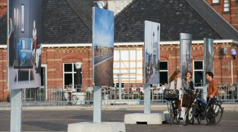

Cet été, je suis allé à [Picnic '06](http://www.crossmediaweek.org/?id=1) pour voir ce que ça donnait. Je n'ai pas vu grand chose puisque les conférences étaient payantes et plutôt chères. Mais pour ma deuxième visite à la *westergazfabriek* j'ai plutôt profité du beau temps et de l'expo photo qui se trouvait sur l'esplanade devant le bâtiment.

### Voir aussi
*[Expo photos en plein air (1)](/expo-photos-en-plein-air)
*[Expo photos en plein air (3)](/expo-photos-en-plein-air-3)
*[Expo photos en plein air (4)](/expo-photos-en-plein-air-4)
*[Expo photos en plein air (5)](/expo-photos-en-plein-air-5)
---