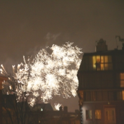
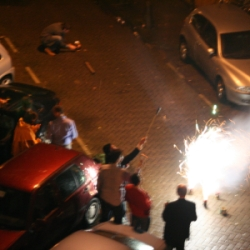

**Amsterdam est la ville des pétards**, tout le monde le sait. [Comme promis](/nouveau-mot-vuurwerk), le nouvel an à Amsterdam a été marqué par le bruit des pétards, fusées et autres feux d'artifice. Le temps n'était pas très encourageant et nous sommes resté à la maison. De notre fenêtre, on pouvait voir de temps à autre quelques trainées de lumières...
11 heures[^1], c'est le nouvel an en Bulgarie et en Roumanie[^2] et on décide de sortir la bouteille de champagne du frigo pour trinquer à leur santé. A boire avant l'heure, on aurait pu oublier minuit mais le bruit de la ville a su nous rappeler le passage de l'ancienne à la nouvelle année.

À l'heure ou les parisiens font péter les bouchons de champagne, des sons détonants fusaient de toutes les rues de la ville. Derrière chaque maison, des gerbes de feux jaillissaient pour célébrer la nouvelle année. Pendant presque une heure, ça n'en finissait pas de pétards de fusées, de pot à feux, de hanabis, de cascades de lumière, de feux de bengale, d'espolettes foireuses, de bombes chinoises et de mammouths, de kamuros, de bouquets[^3], d'étoiles (*steretjes*) de toutes les couleurs, de comètes, de sifflets et de pivoines et des gros marrondairs qui font siffler les oreilles.

<!-- HTML -->

<!-- HTML -->

Ce n'est pas facile dans ces conditions de prendre des photos et beaucoup de mes clichés ressemblent à ceux que je n'ai jamais pris à Bobigny une nuit de novembre 2005... Pourtant la bonne humeur se lisait sur les visages de tous ceux qui descendaient dans la rue. La fête du nouvel an à Amsterdam, c'est peut être bruyant mais c'est unique. On a rouvert une bouteille pour la peine.

---
[^1]: Les Néerlandais ne disent pas 23h...
[^2]: Les 26e et 27e membres de l'Union Européenne. L'histoire ne dira pas s'il font partie de l'Union depuis 23h CET ou non ...
[^3]: non, pas encore le bouquet final