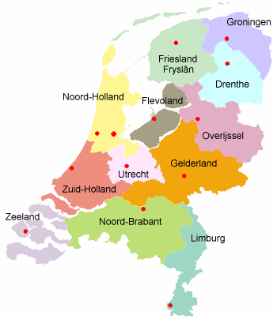

Je vais m'efforcer ici de présenter les singularité de chacune de ces provinces avec un point de vue qui ne manqueras pas d'être le mien (français d'Amsterdam)... Pour un avis plus détaillé, les liens sur Wikipedia (merci pour la carte) sont de bonnes pistes. 

{.right}

<!-- HTML -->

<!-- / HTML -->
## La Frise (Friesland *Fryslân*)
Cette province du nord-ouest du pays est singulière par son bilinguisme. Le frison est une langue à part entière et leurs locuteurs en sont fiers. La plupard des îles de la Frise sont aussi ratachées à cette région, dont la mer côtière (mer des Wardens) lui apporte ses richesses naturelles et touristiques. Les frisons sont aussi des grands patineurs. Ils organisent quand le temps le permet, une course des 7 villes sur les cannaux gelés. Les champions olympiques de patinages de vitesse sont souvent des frisons.   [plus...](http://fr.wikipedia.org/wiki/Frise_%28province%29)

<!-- HTML -->

<!-- / HTML -->
## Groningue (Groningen)
Privince agricole du nord-est dont la capitale porte le même nom. Cette capitale est connue pour son université réputée et son école supérieur qui donne à la ville un caratère jeune et estudiantin. Il semblerait aussi que la région soit un fief du PvdA, le parti travailliste.
  [plus...](http://fr.wikipedia.org/wiki/Groningue_%28province%29)

<!-- HTML -->

<!-- / HTML -->
## Drenthe
Province rurale par escellence, c'est aussi un fief du PvdA et comme sa voisine du nord. Le dialecte local est spécifique avec des influances frisones et saxones, il est de moins en moins parlé.
  [plus...](http://fr.wikipedia.org/wiki/Drenthe)

## Flevoland
Cette petite province est une province nouvelle. Elle existe officiellement depuis le 1er janvier 1986 avec pour capitale, la ville de Lelystad. Son territoire, presque entièrement formé de polder récents (à partir de 1930) est facilement identifiable [par avion](http://maps.google.nl/maps?f=q&hl=nl&q=lelystad&ie=UTF8&z=9&ll=52.542537,5.478058&spn=0.643086,2.746582&t=h&om=1). De par son peuplement récent, cette province est la seule qui ne revendique aucun dialecte local.
  [plus...](http://fr.wikipedia.org/wiki/Flevoland)

<!-- HTML -->

<!-- / HTML -->
## Overijssel
Cette province porte le nom de la grande rivière qui la borde, (*IJseel*). Les français en on fait le département des Bouches-de-l'Yssel. La capitale est Zwolle et l'influence Allemande est plus forte dans le dialecte local qui vient du bas-saxon et dans les paysages qui ne sont pas formés que de polders. 
  [plus...](http://fr.wikipedia.org/wiki/Overijssel)

<!-- HTML -->

<!-- / HTML -->
## Gueldre (Gelderland)
C'est la plus grande province des Pays-Bas en superficie. Mais ce n'est pas la plus grande en population ni en renomée puisque on pourrait la qualifier d'étendue déserte entre [le Randstad](/le-randstad) et la Ruhr. Ce n'est pourtant pas une province déserte. Sa capitale Arnhem compte 140.000 habitants et sa voisine Nimègue en compte 160.000. Comme l'Overijsel, la Gueldre compte peu de polders et les dialectes sont bas-saxons.
  [plus...](http://fr.wikipedia.org/wiki/Gueldre_%28province%29)

<!-- HTML -->

<!-- / HTML -->
## Hollande septentrionale (Noord-Holland)
C'est la province qui m'héberge au sein de la capitale du pays. Pourtant, la capitale de la Hollande septentrionale est Haarlem, à l'est d'Amsterdam. Le sud de cette province est très peuplée mais le nord, très rural offre les meilleurs paysages hollandais. C'est la province connue pour ses tulipes (nottemment à Lisses) et ses marchés au Fromage (nottement à Alkmaar). On y trouve aussi quelques petits ports et plein de [moulins](/les-moulins-d-amsterdam).
  [plus...|http://fr.wikipedia.org/wiki/Hollande_septentrionale|]

<!-- HTML -->

<!-- / HTML -->
## Hollande méridionale (Zuid-Holland)
Deuxième province de Hollande, c'est la soeur et la rivale de sa provinde du nord. La Haye disputant à Amsterdam sa position de capitale administrative et Rotterdam lui disputant avec succès sa position de plus grand port d'Europe. On y retrouve aussi tulipes et moulins mais cette province est la plus peuplée des deux avec des villes comme Rotterdam, la Haye, Gouda, Delft et Leyde. Ces deux provinces des Pays-Bas sont le c?ur économique et politique du pays ce qui fait qu'on parle souvent de **Hollande** pour désigner l'ensemble des **Pays-Bas**...
  [plus...](http://fr.wikipedia.org/wiki/Hollande_m%C3%A9ridionale)

<!-- HTML -->

<!-- / HTML -->
## Utrecht
C'est la troisième provinde du Randstad avec sa capitale Utrecht, quatrième ville du pays. Les évèques d'Utrecht ont lontemps été les rivaux de leurs seigneurs voisins de Hollande et de Gueldre ce qui fait que cette petite province est encore aujourd'hui indépendente. Utrecht a une position centrale dans le pays, que ce soit pour le rail, les autoroutes  où les voies d'eau. Utrecht s'affirme donc comme une capitale dynamique avec la plus grande université des Pays-Bas et le siège de la NS (compagnie Néerlandaise de transport féroviaire). C'est aussi un centre internationnal de conférences grâce à la Jaarbeurs.
  [plus...](http://fr.wikipedia.org/wiki/Utrecht_%28province%29)

<!-- HTML -->

<!-- / HTML -->
## Zélande (Zeeland)
La province maritime du sud porte bien son nom. *Zeeland* signifie terre de la mer. Son territoire était constitué d'îles isolées et de presqu'îles dans le delta de l'Escaut et du Rhin. Le dialecte local est le zélandais très proche du flamand. Le sud de la province possède une grande frontière avec la Belgique voisine alors que son seul lien avec la reste des Pays-Bas est un tunnel sous l'Escaut. Cette région est la plus sensible aux assauts de la mer et une grande innondation de 1953 provoqua la mort de miliers de personnes. Depuis, des grands travaux ont protégé la région et cela a permis de désenclaver les îles. Le tourisme s'y développe accompagné d'une spéculation immobilière.
  [plus...|http://fr.wikipedia.org/wiki/Z%C3%A9lande|]

<!-- HTML -->

<!-- / HTML -->
## Brabant septentrional (Noord-Brabant)
Le duché du Brabant s'est rassemblé au moyen age autour des villes de Louvain, Bruxelles, Anvers et Bois le Duc. Après la révolte contre l'occupation espagnole, les Provinces Unies deviennent indépendentes mais le Brabant reste, comme beaucoup de provinces catholiques du sud, fidèle à la courrone espagnole. Le Brabant va alors être disputé et sa partie septentrionale sera ratachée aux Provinces Unies. Cette province est aujourd'hui une province à majorité catholique du sud du pays. C'est une région à fort développement industriel comptant plusieurs villes importantes. Eindhoven, la ville de Philips (et de DAF) en est le plus grand exemple.
  [plus...](http://fr.wikipedia.org/wiki/Brabant_septentrional)

<!-- HTML -->

<!-- / HTML -->
## Limbourg (Limburg)
La petite province du Limbourg fut aussi duché du temps de l'occupation espagnole mais ce duché disparaît avec l'avènement des Provinces Unies, il devient dépendance de la Hollande. En 1815 le nom de Limbourg réapparaît en tant que province du nouveau royaume des Pays-Bas. La Belgique se détachant des Pays-Bas en 1830, **le Limbourg se retrouve divisé en deux provinces portant le même nom** mais dans deux pays différents. La province des Pays-Bas rassemble les terres à l'est de la Meuse ainsi que la place forte de Maastricht qui en est la préfecture. Cette province au seuil des Ardennes est la plus élevée des Pays-Bas. Le point le plus haut, le Vaalserberg, culmine à 220m. Cette province est aussi à grande majorité catholique et possède son propre dialecte, le limbourgois, une langue [francique](http://fr.wikipedia.org/wiki/Francique). Toutefois, les différences d'accents sont tellemment prononcées d'un village à l'autre que les Limbourgeois ont du mal à se comprendre entre eux autrement qu'en Néerlandais.
  [plus...](http://fr.wikipedia.org/wiki/Limbourg_%28Pays-Bas%29)
---