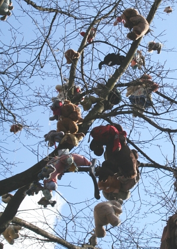
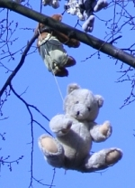
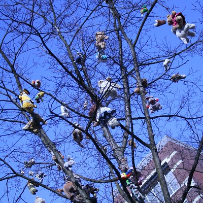

{.left}
**Ceci n'est pas un conte de Noël**

C'est par une belle matinée de l'hiver 2005, je découvrais encore Amsterdam et je pensais encore que c'était une ville agréable à vivre pour tous. Je pensais que toutes les habitants d'Amsterdam étaient cools et heureux de vivre dans cette ville, tout près de ces canaux bordés de maisons flamandes. Parfois, l'alure sympatique des gens n'est qu'un leure, l'apparence de bien-être cache des drames et j'ai été témoin de ce genre de drame. En ce matin du 26 février 2005, j'ai découvert avec stupeur cette scène horrible. Si l'arbre pouvait parler, il serait aphone à l'idée de devoir racconter ce qu'il a vu cette nuit là. des dixaines de peluches, des nounours, des mille-pattes et même un Némo sont tous pendus à ses branches.

[{.center}](http://alix.guillard.fr/phototeque/view_photo.php?set_albumName=amsterdam&id=img_3092)

Aujourd'hui ce suicide reste pour moi un mystère. Je pense souvent à ces peluches qui ont eu une vie si brève. J'ignore tout de leur conditions de vie, j'ignore si une enquète a été déclanchée, tout ce que je sais c'est que dans cette sinistre nuit du 25 au 26 février, elles ont toutes décidées de mettre fin à leur jours sur le même arbre, sous les mêmes fenêtres.

[{.center}](https://www.flickr.com/photos/13274211@N00/297395694/)
