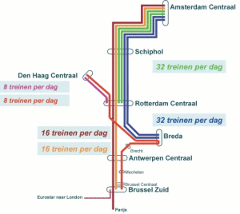

Les habitués du Thalys le savent, le train est plus lent une fois qu'il est aux Pays-Bas. **Les voies qui ne sont pas adaptées aux grandes vitesses des Thalys** et les arrêts (Rotterdam CS, Den Haag HS, Schiphol Airport et Amsterdam CS) qui lui font prendre une route sinueuse allongent le voyage. Les choses devraient changer en 2007.
{.left}
## Le Thalys à grande vitesse
Il y a plus de 10 ans, le 2 juin 1996, le premier Thalys relie Paris à Amsterdam en 4h47. Thalys est né d'une volonté française d'exporter son système de TGV. Filiale de la SNCF et de la SNCB, Thalys compte aussi comme associés la DB Allemande et la NS Néerlandaise, nottemment pour les services à bord.

## Une ligne à grande vitesse dans le Randstaatd
Passé Andwerpen (*Anvers*), le Thalys roule plus lentement parce que les voies de chemin de fer ne sont pas adaptées aux grandes vitesses. Les Pays-Bas ont aussi moins d'intérrêt à construire de nouvelles voies uniquement pour être plus proches de Bruxelles. Il faut que ces voies à grande vitesse soient aussi utiles pour les habitants des régions traversées, que cela apporte un véritable plus à la région. Le projet de voie férrée rapide nait donc avec la volonté de relier les grandes villes des Pays-Bas.

## Le temps de la construction
Comme partout en Europe, la construction et la gestion des voies est confiée à un organisme public. Au Pays-Bas c'est ProRail. Le projet s'appelle [HSL Zuid](http://www.hslzuid.nl/) pour *De Hogesnelheidslijn-Zuid*, et la construction est confié au consortium [Infraspeed](http://www.infraspeed.nl/), regroupant les principaux acteurs industriels et financiers de la construction. Comme souvent dans ce genre de projet, les acteurs privés aiment voir l'argent public couler à flot et la construction ne se déroule pas toujours comme prévu. Après plusieurs ralonges budgetaires et reports, la ligne devait être livrée en 2007 mais n'est pas terminée. [Le ministre des transport et Siemens se rejettent la balle](http://www.ambafrance.nl/article.php?id_article=8013). Le consortium Infraspeed a aussi obtenu la concession pour l'entretien de cette ligne jusqu'en 2030.

{.center}

## Les trains à grande vitesse
Quand la ligne sera en service, les Thalys pourront rouller plus vite mais il y aurra aussi des trains de la compagnie HSA (pour [High speed aliance](http://www.highspeedalliance.nl/static/hsa/nl/overhsa.html)), filialle de NS et de KLM, qui desserviront les villes de **Breda**, **Den Haag**, **Rotterdam** ainsi que les villes belges de **Bruxelles** et **Antwerpen**.

## Le Thalys encore plus vite
Quand ces lignes seront ouvertes, vraisemblablement en 2008, le Thalys ne désservira plus La Haye et [selon les plaquettes](http://www.hslzuid.nl/hsl/vervoer/reistijden/index.jsp), mettrait 3h13 au lieu de 4h09 actuelement. Un net progrès qui vous fera préférer le train, à moins que ce bonheur ne puisse pas être partagé par toutes les bourses...

## Le Thalys encore moins vite
Après avoir cité tous ces slogans publicitaire, on peut faire le point sur l'avancée des travaux... Selon [la revue de presse Néerlandaise d'aujourd'hui](http://www.ambafrance.nl/article.php?id_article=8135), la ministre des Transports et Voies d?Eau, Karla Peijs, a écrit à la Deuxième Chambre hier pour signaler qu'il devrait y avoir un an et demi de retard. 

> C'est surtout le système de sécurité ERTMS[^1] qui pose de nouveaux problèmes. Maintenant que le logiciel a été adapté, le système doit être testé avec un train spécial. Tant de parties sont impliquées dans ces essais (le fournisseur Siemens, le transporteur HSA, le gestionnaire du rail ProRail, l'Inspection des Transports et Voies d?Eau) que Peijs craint qu?on ne dépasse de nouveau les dates-buttoirs.
> Par ailleurs, on ne sait toujours pas si La Haye et Breda seront desservies. Et la ministre a toujours un contentieux avec HSA sur la commande tardive des locomotives (surcoût occasionné : 50 millions d'euros).

Une député à commenté cette lettre en disant «*On dirait la loi de Murphy : tout va de travers*». Pas génial pour un train.

* Voir aussi [Tintin conduit le Thalys](/tintin-conduit-le-thalys)
* voir aussi aussi : [Un Thalys peut en cacher un autre](/un-thalys-peut-en-cacher-un-autre).

---
[^1]: European Rail Traffic Management System, le système européen de surveillance du trafic ferroviaire visant à harmoniser la signalisation ferroviaire en Europe.
<!-- post notes:
en partant à 18h56, j'arriverais à 22h17 au lieu de 23h 05
--->
