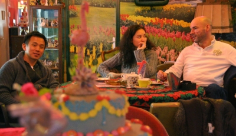

Comme il est d'usage sur les blogs, je vais parler de ma petite vie et plus spécialement de mon dernier week end. Maintenant que je travaille, c'est la période idéale avec la nuit pour avoir du temps libre. En cette fin de semaine, des amis venaient de loin pour passer quelques jours à Amsterdam. En les accompagnant, nous en avons profité pour faire quelques découvertes culinaires dont je vais vous faire part.

### La tarte de ma tante (taart van m'n tant)
Samedi après-midi, il fallait trouver un lieu pour se retrouver pour le *afternoon tea*, le thé de quatre heures. Depuis longtemps que je passais devant ses vitrines pleines de gâteaux aussi faux qu'apétissants et colorés, il fallait bien essayer ce salon nommé [taart van m'n tant](http://detaart.com/en/home.htm). Dans la déco *Granny-kitch* se cachent des ordinateurs, des livres pour enfant et des *big Jim* entièrement nus. Évidemment, le thé nous est servi dans un service dépareillé que j'aurais bien vu plus coloré. Nous n'avons pas pu nous retenir de commander des tartes évidemment et elles étaient toutes bonnes.

{.center}

### Les bons restos d'Amsterdam
Beaucoup de sorties gastronomiques m'ont fait découvrir quelques restaurants méconnus de la ville. En général, s'il on veut bien manger quand on sort à Amsterdam, il faut y mettre le prix. Les bonnes petites tables me semble plus rares qu'à Paris. Il y a aussi de très bonnes tables à Amsterdam comme celle de samedi soir dont mes papilles salivent encore. A cette [Utrechtsedwarstafel](http://www.utrechtsedwarstafel.com/) J'ai découvert deux choses sur **les restos à Amsterdam**. La première est [ce petit guide](http://www.nl.bol.com/is-bin/INTERSHOP.enfinity/eCS/Store/nl/-/EUR/BOL_DisplayProductInformation-Start?BOL_OWNER_ID=1001004002607787&Section=BOOK) qui trainant au fond de la salle et qui semble être super bien. La seconde que dans quelques semaines, **les restaurants d'Amsterdam organisent leur *semaine du goût***. Ça s'appelle [restaurantweek](http://www.restaurantweek.nl/) et c'est bientôt.

Voir aussi :[Fin de la semaine du goût](/fin-de-la-semaine-du-gout)
---