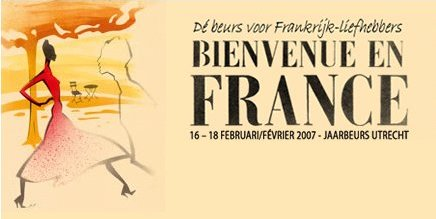

Du 16 au 18 février, le Salon **Bienvenue en France** se tiendra à la Jaarbeurs d'Utrecht. [Le site web](http://www.bienvenueenfrance.nl) précise en français :

> Bienvenue en France est l'événement de référence pour les consommateurs passionnés par la France. Culture, gastronomie, propriété et tourisme... autrement dit le meilleur de la France sous un seul toit, celui de la *jaarbeurs* à Utrecht.

{.center}

Tout est dit dans cet article, **La France est interessante pour les Néerlandais**, au point d'avoir un salon qui lui est consacré. On sait que la France est un lieu de vacances privilégié pour les Néerlandais, ils sont nombreux à venir avec leur caravane dans les campings de Dordogne et d'ailleurs. Certains y achêtent même leur résidence secondaire[^1]. Il y en a même qui profitent de leur séjour en France pour goûter à la cuisine locale.

Il semble y avoir ici un véritable engouement pour la France et l'espèce d'art de vivre insaisissable qu'elle représente. On retrouve ceci dans le nom de certains produits chez Albert Hein et dnas les «CÔTE D'AZUR» imprimé sur les tables en terrasse de certain cafés. Cette francitude un peu artificielle ne se traduit pas par une amélioration de la balance commerciale entre nos deux pays. Apparemment les Néerlandais et les Français se cherchent encore...

Le salon Bienvenue en France tentera de remplir les vides en proposant aux Néerlandais tout ce dont ils ont besoin quand on parle de France : des cours de langue[^2], des agents immobiliers, des restaurants et des produits du terroir ainsi que la chanson française... C'est dès demain et c'est à la jaarbeurs d'Utrecht.

---
[^1]: Même si des fois [cette maison est privée d'électricité](http://www.ptb.be/international/article.phtml?section=A1AAABBV&object_id=26882).
[^2]: La vrai langue française, avec [Merde](http://home.planet.nl/~reprise/arti-choc.html), le manuel du vrai français !