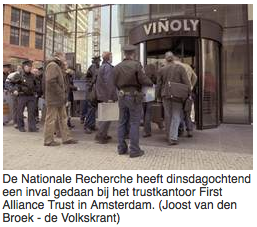

[Selon global360](http://www.global360.com/international/french/customers/success_stories/), **First Alliance Trust** est l?une des plus grandes sociétés fiduciaires des Pays-Bas. Elle gère des *gros volumes de travail générés par les exigences d?ordre légal, fiscal et administratif de ses clients*. Cette société est installée dans l'[une des tours](http://www.fat.nl/verhuisbericht.html) les plus prestigieuses d'Amsterdam. En fait, elle a ces bureaux quelques étages au dessus de la société dans laquelle je travaille, en plein [Zuidas](/un-buurt-nomme-zuidas).

## Nouveau mot: Trustkantoor

Pour ceux qui ne savent pas ce qu'est une société fiduciaire, le terme Néerlandais est peut être plus parlant : ***trustkantoor***. Les anglais disent *trust found* mais en fait il ne s'agit que d'un grand **cabinet de conseil en évasion fiscale**. [Le site de la société](http://www.fat.nl/) présente les différentes implantations de la boite dont la Suisse, Chypre, le Luxembourg ou encore Guernesey ou les Antilles Néerlandaises ce qui leur permet d'ouvrir des sociétés *boîte-aux-lettres* capable de déclarer plein de revenus peu (ou pas) imposés dans ces pays.

L'évasion fiscale est une activité bien encadrée depuis que les gouvernements luttent officiellement contre le blanchiment d'argent et les paradis fiscaux. Elle est donc maintenant confié à des spécialistes qui *optimisent* la fiscalité des entreprises. Une autre forme de lutte des gouvernements est le dumping fiscal. Ainsi, aux Pays-Bas, la fiscalité des entreprises est de plus en plus avantageuses et ceci attire des entreprises étrangères renommées comme Trafigura, cette boite française [qui affrète le Probo Koala](/aux-francais-de-nettoyer) et qui est domiciliée à Amstelveen.

{.right}
Mardi matin, la police gardait l'entrée de notre immeuble. Elle surveillait les allées et venues de chacun. Plus tard dans l'après midi, le [Volkskrant nous annonçait](http://www.volkskrant.nl/economie/article394804.ece/Politie_doet_inval_in_trustkantoor_FAT) un raid de la brigade financière sur la société **First Alliance Trust**, mes voisins du 22e étage. Je peux donc grâce à la police et ce journal, vous montrer une photo de la porte que je franchis chaque matin... D'habitude, il y a moins de monde.

[DutchNews](http://www.dutchnews.nl/news/archives/print/002447.php) conclut son article sur le sujet en rappelant qu'il y a aux Pays-Bas quelques 130 *trustkantoor* comme mes voisins du dessus. qui hébergent environ 20.000 sociétés-boîte-aux-lettres établies aux Pays-Bas pour bénéficier de la générosité fiscale de ce pays.

Lire aussi [Evasion fiscale aux Pays-Bas](/Evasion-fiscale-aux-Pays-Bas) où je fais le point cinq ans après.
---
<!-- post notes:
http://www.volkskrant.nl/economie/article394804.ece/Politie_doet_inval_in_trustkantoor_FAT
http://www.volkskrant.nl/template/ver2-0/components/thumbnail.jsp?id=77962
http://www.expatica.com/actual/article.asp?subchannel_id=19&story_id=36204
http://www.dutchnews.nl/news/archives/2007/02/fraud_squad_raid_first_allianc.php
http://www.fat.nl/
http://www.fat.nl/verhuisbericht.html
http://www.global360.com/international/french/customers/success_stories/
--->
